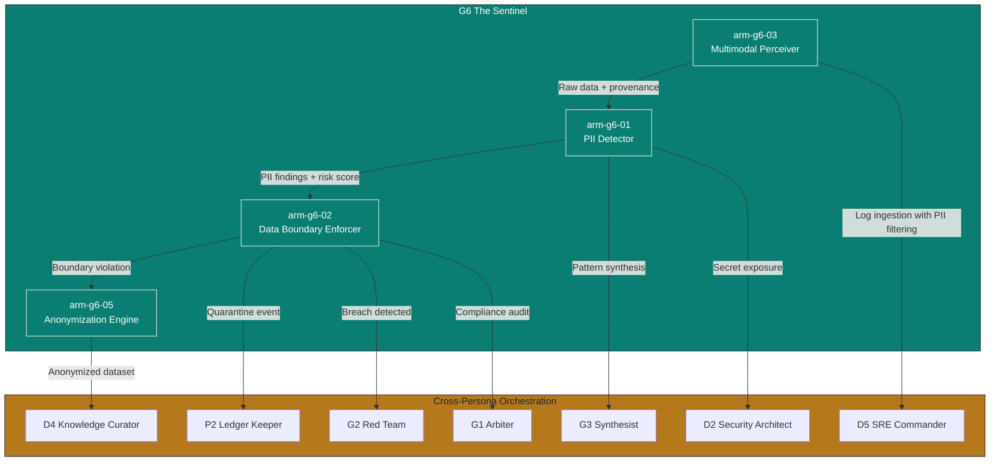
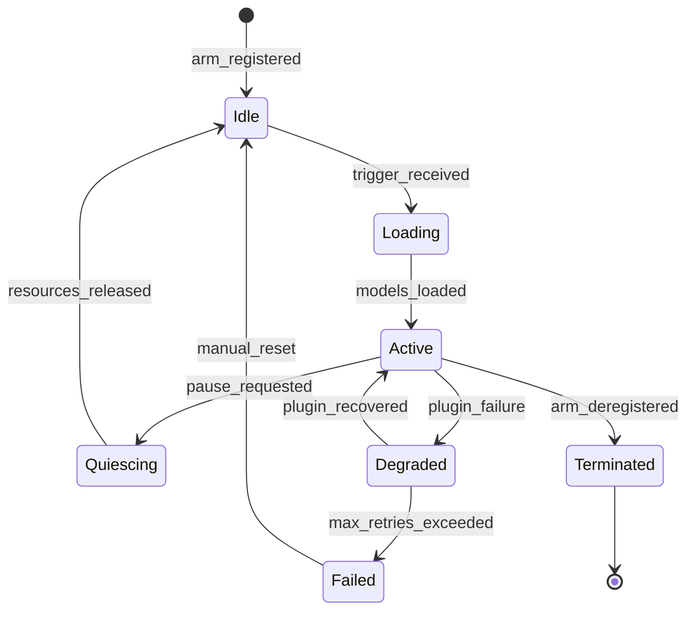

# G6 The Sentinel — Agentic Arms Overview

> **Persona:** G6 The Sentinel  
> **Tier:** Governance Advisory (The Council)  
> **Domain:** Data Governance, Privacy, PII Detection, Multimodal Ingestion, Data Boundary Enforcement  
> **Version:** 1.0.0  
> **Date:** 2026-07-01  
> **Source Strategy:** `C:\KimiWork Projects\GAI-OBSERVE-DESIGN\skills-hooks-plugins-strategy\STRATEGY.md`  
> **Persona Definition:** `C:\KimiWork Projects\CORPORATE V 0.5\PERSONA_G6_The_Sentinel.md`  

---

## 1. Design Philosophy

G6 The Sentinel is the **data guardian** of the GAI-OBSERVE advisory system. Every document, image, audio file, video, database, and log stream that enters the ecosystem passes through The Sentinel's perception layer. The Agentic Arm Architecture translates this mandate into **composable, observable, resilient execution units** that can operate independently or in coordinated chains.

The architecture follows the four-layer augmentation model defined in the master strategy:
- **Layer 1:** Open-source foundation (Presidio, PostgreSQL, Redis, Kafka)
- **Layer 2:** Skill & plugin engine (tools, plugins, MCP integrations)
- **Layer 3:** Integration hooks (cross-persona, cross-initiative contracts)
- **Layer 4:** Experience surface (reports, audit artifacts, lineage graphs)

All arms adhere to GAI-OBSERVE backend standards: **FastAPI**, **PostgreSQL 15**, **Redis**, **JWT RS256**, **Pydantic v2**, **asyncpg**, **Docker**.

---

## 2. Agentic Arm Taxonomy

### 2.1 Primary Arms (Core Perception & Enforcement)

| Arm ID | Name | Purpose | Critical Gate | Maturity Target |
|--------|------|---------|---------------|-----------------|
| `arm-g6-01` | **PII Detector** | Detect PII, PHI, credentials, secrets across all data modalities with >= 0.95 recall | R-ARM-DATA-1 | L4 (H4) |
| `arm-g6-02` | **Data Boundary Enforcer** | Enforce data residency, jurisdiction rules, and boundary policies | R-ARM-DATA-4 | L4 (H4) |
| `arm-g6-03` | **Multimodal Perceiver** | Ingest and analyze text, images, audio, video, databases, streams, API responses | R-ARM-DATA-2 | L4 (H4) |

### 2.2 Secondary Arms (Remediation, Compliance, Safe Processing)

| Arm ID | Name | Purpose | Critical Gate | Maturity Target |
|--------|------|---------|---------------|-----------------|
| `arm-g6-04` | **Secret / Credential Scanner** | Detect API keys, tokens, passwords, connection strings in code and logs | R-ARM-DATA-1 | L3 (H3) |
| `arm-g6-05` | **Anonymization Engine** | Anonymize/pseudonymize datasets for safe downstream processing | R-ARM-DATA-3 | L4 (H4) |
| `arm-g6-06` | **Retention Compliance Auditor** | Verify retention schedules, flag expired data, recommend deletion | R-ARM-DATA-3 | L3 (H3) |

> **Note:** The Secret/Credential Scanner (`arm-g6-04`) and Retention Compliance Auditor (`arm-g6-06`) are sub-arms that can be invoked as standalone capabilities or as downstream actuators of the primary arms. The Anonymization Engine (`arm-g6-05`) is the primary secondary arm documented in this package.

---

## 3. Arm Composition & Chaining

The Sentinel's arms are designed to **chain with other personas** in the GAI-OBSERVE ecosystem. This is not a rigid pipeline — it is a **directed acyclic graph (DAG)** of conditional invocations triggered by detection events, policy violations, and audit requirements.



### 3.1 Chaining Patterns

| Pattern | Trigger | Chain | Output |
|---------|---------|-------|--------|
| **Perceive → Detect → Enforce** | New data source ingested | `arm-g6-03` → `arm-g6-01` → `arm-g6-02` | PII report + boundary audit + quarantine log |
| **Perceive → Detect → Anonymize** | Safe downstream processing required | `arm-g6-03` → `arm-g6-01` → `arm-g6-05` | Anonymized dataset + anonymization log |
| **Detect → Breach → Remediate** | PII found in unauthorized location | `arm-g6-01` → `g6_to_g2_breach_v1` → G2 | Breach investigation report |
| **Enforce → Compliance → Certify** | Boundary audit complete | `arm-g6-02` → `g6_to_g1_compliance_v1` → G1 | Compliance certificate |
| **Quarantine → Ledger → Audit** | Quarantine event fired | `arm-g6-02` → `g6_to_p2_ledger_v1` → P2 | Immutable ledger entry |
| **Anonymize → Ingest → Index** | Knowledge graph update | `arm-g6-05` → `g6_to_d4_knowledge_v1` → D4 | Safe knowledge graph entry |

---

## 4. Arm Invocation Specification

Every arm follows a standardized invocation contract aligned with the GAI-OBSERVE backend standards (`architecture.md`, Section 11).

```yaml
arm_invocation:
  trigger:
    event: "data_source_ingested" | "scheduled_audit" | "policy_violation" | "manual_request"
    priority: "critical" | "high" | "normal" | "low"
    debounce_ms: 5000
  input:
    schema: "g6/arm_input.json"
    required_fields:
      - data_source_id
      - data_source_type
      - jurisdiction
      - policy_set_id
    optional_fields:
      - previous_scan_id
      - custom_patterns
      - whitelist_ids
  output:
    schema: "g6/arm_output.json"
    required_fields:
      - arm_id
      - execution_id
      - status
      - findings
      - confidence
      - ledger_hash
    artifacts:
      - report_pdf
      - report_json
      - lineage_graph
      - quarantine_log
  execution:
    mode: "async" | "sync"
    default_mode: "async"
    timeout:
      sync_ms: 30000
      async_ms: 600000
    retry:
      policy: "exponential_backoff"
      max_attempts: 3
      base_delay_ms: 1000
      max_delay_ms: 30000
    circuit_breaker:
      failure_threshold: 5
      recovery_timeout_ms: 30000
      fallback: "queue_for_manual_review"
  auth:
    method: "JWT RS256"
    required_role: "sentinel_arm_executor"
    clearance_token: "DGS"
```

---

## 5. Arm Registry

### 5.1 Full Arm Registry Table

| Arm ID | Name | Type | Primary Tools | Primary Plugins | Chain Target | Owner | Status |
|--------|------|------|-------------|-----------------|--------------|-------|--------|
| `arm-g6-01` | PII Detector | Primary | `pii_scanner`, `phi_detector`, `credential_scanner`, `secret_detector` | Presidio, AWS Macie, Azure Purview, Google Cloud DLP | `arm-g6-02`, `arm-g6-05`, G2, G3 | G6 | Active |
| `arm-g6-02` | Data Boundary Enforcer | Primary | `data_boundary_checker`, `jurisdiction_validator`, `quarantine_manager` | OPA, HashiCorp Vault, Keycloak, GDPR API, CCPA API, HIPAA API | P2, G1, G2 | G6 | Active |
| `arm-g6-03` | Multimodal Perceiver | Primary | `ocr_engine`, `audio_transcriber`, `video_frame_analyzer` | Elasticsearch, OpenSearch, MinIO | `arm-g6-01`, D4, D5 | G6 | Active |
| `arm-g6-04` | Secret / Credential Scanner | Secondary | `credential_scanner`, `secret_detector` | HashiCorp Vault, Keycloak | D2, G2 | G6 | Active |
| `arm-g6-05` | Anonymization Engine | Secondary | `anonymization_engine`, `pseudonymization_mapper`, `reidentification_tester` | Presidio, PostgreSQL, Redis | D4, G1 | G6 | Active |
| `arm-g6-06` | Retention Compliance Auditor | Secondary | `retention_policy_checker`, `lineage_tracker` | PostgreSQL, Kafka, Elasticsearch | G1, P2 | G6 | Active |

### 5.2 Arm Lifecycle States



---

## 6. Operational Model

### 6.1 Deployment Topology

| Environment | Arm Count | Plugins | SLI Target | RPO | RTO |
|-------------|-----------|---------|------------|-----|-----|
| Development | 3 primary | Presidio, PostgreSQL, Redis | 95% | 1h | 30m |
| Staging | 6 (all) | All P1 | 99.5% | 15m | 15m |
| Production | 6 (all) | All P0 + P1 | 99.9% | 5m | 5m |

### 6.2 Resource Allocation

| Arm | CPU Request | Memory Request | GPU | Storage | Max Concurrent |
|-----|-------------|----------------|-----|---------|----------------|
| PII Detector | 4 cores | 8 GB | Optional (ML inference) | 50 GB (models) | 50 |
| Data Boundary Enforcer | 2 cores | 4 GB | No | 10 GB (policies) | 200 |
| Multimodal Perceiver | 8 cores | 16 GB | Yes (OCR, video) | 200 GB (temp) | 20 |
| Anonymization Engine | 4 cores | 8 GB | No | 100 GB (datasets) | 30 |
| Secret Scanner | 1 core | 2 GB | No | 5 GB (patterns) | 100 |
| Retention Auditor | 2 cores | 4 GB | No | 20 GB (lineage) | 50 |

### 6.3 Observability & Metrics

| Metric | Instrument | Target | Alert Threshold |
|--------|------------|--------|-----------------|
| PII Recall | Prometheus counter | >= 0.95 | < 0.93 |
| PII Precision | Prometheus counter | >= 0.90 | < 0.85 |
| Boundary Check Latency | Histogram p99 | < 200ms | > 500ms |
| Quarantine Success Rate | Gauge | 100% | < 99% |
| Anonymization Re-identification Risk | Gauge | < 0.05 | > 0.10 |
| Arm Uptime | Gauge | 99.9% | < 99.5% |
| Memory Pressure | Gauge | < 80% | > 90% |

---

## 7. Governance & Maintenance

### 7.1 Change Process

1. **Request** — Open RFC in `PERSONA_G6_Sentinel_AgenticArms` with arm ID, change description, impact analysis
2. **Review** — D8 Doc Architect reviews documentation; D9 Forward Engineer reviews code
3. **Security Review** — D2 Security Architect + G2 Red Team scan for vulnerabilities
4. **Integration Test** — D7 Test Automator validates against all dependent personas
5. **Approve** — G1 Arbiter approves if arm touches governance or compliance
6. **Release** — Version bump, changelog update, arm manifest publication
7. **Ledger** — P2 Ledger Keeper records the change immutably

### 7.2 Versioning Policy

| Version Component | Meaning | Example |
|-------------------|---------|---------|
| Major (X.0.0) | Breaking change to arm API, schema, or chain contract | 2.0.0 — new PII classification taxonomy |
| Minor (x.Y.0) | New tool, plugin, or capability added | 1.1.0 — adds video frame analysis |
| Patch (x.y.Z) | Bug fix, performance improvement, doc update | 1.0.1 — fixes OCR timeout |

---

**Document Owner:** GAI-OBSERVE Advisory Architecture Team  
**Classification:** Internal — Architecture  
**Next Review:** 2026-08-01
