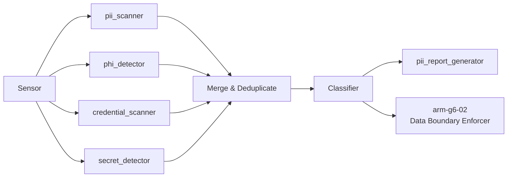

# ARM-G6-01: PII Detector

> **Arm ID:** `arm-g6-01`  
> **Persona:** G6 The Sentinel  
> **Type:** Primary Arm  
> **Critical Gate:** R-ARM-DATA-1 — PII recall >= 0.95  
> **Maturity Target:** L4 (H4) — self-driving data governance  
> **Version:** 1.0.0  
> **Status:** Active  

---

## 1. Arm Manifest

```yaml
arm_manifest:
  arm_id: "arm-g6-01"
  name: "PII Detector"
  description: "Detects PII, PHI, credentials, and secrets across all data modalities using ML models, regex patterns, and heuristics. Generates classification reports with redacted samples and interfaces with DataGov for policy enforcement."
  persona: "G6 The Sentinel"
  tier: "primary"
  critical_gate: "R-ARM-DATA-1"
  recall_target: 0.95
  precision_target: 0.90
  modalities: ["text", "image", "audio", "video", "structured"]
  data_classes:
    - pii
    - phi
    - credentials
    - secrets
    - payment_card
    - financial
    - biometric
  owner: "G6 The Sentinel"
  maintainer: "D2 The Security Architect"
  reviewer: "P3 The Hallucination Guard"
  status: "active"
  version: "1.0.0"
  created: "2026-07-01"
  last_updated: "2026-07-01"
```

---

## 2. Sensors

Sensors are the data ingestion interfaces that feed the PII Detector. Each sensor is modality-aware and produces a standardized `RawDataSegment` for downstream analysis.

| Sensor ID | Modality | Source | Format | Throughput | Auth |
|-----------|----------|--------|--------|------------|------|
| `sns-text-01` | Text | API request body, document files, code, logs | UTF-8, Markdown, JSON | 10 MB/s | JWT |
| `sns-image-01` | Image | Uploaded images, screenshots, scanned docs | PNG, JPEG, TIFF, WebP | 50 images/min | JWT |
| `sns-audio-01` | Audio | Call recordings, voice memos, meeting audio | WAV, MP3, FLAC, OGG | 5 hours/min | JWT |
| `sns-video-01` | Video | Training videos, meeting recordings, screen captures | MP4, AVI, MOV, WebM | 2 hours/min | JWT |
| `sns-structured-01` | Structured | Databases, spreadsheets, CSV, JSONL, Parquet | SQL, CSV, XLSX, Parquet | 100K rows/s | JWT + DB creds |
| `sns-stream-01` | Stream | Kafka topics, log streams, Kinesis, Pub/Sub | Avro, Protobuf, JSON | 1M events/min | mTLS + SASL |

### Sensor Output Schema

```json
{
  "sensor_id": "sns-text-01",
  "data_source_id": "ds-repo-healthcare-app-001",
  "segment_id": "seg-20260701-001",
  "timestamp": "2026-07-01T12:00:00Z",
  "modality": "text",
  "raw_content_hash": "sha256:a3f2...",
  "content_preview": "[REDACTED — 1.2 KB]",
  "encoding": "utf-8",
  "language_detected": "en",
  "jurisdiction": "EU-GDPR",
  "policy_set_id": "pol-gdpr-hipaa-001"
}
```

---

## 3. Tools

| Tool ID | Name | Description | Execution Mode | Timeout | Retry |
|---------|------|-------------|---------------|---------|-------|
| `tool-pii-01` | `pii_scanner` | Multi-regex + NER-based PII detection across text and structured data | Sync | 30s | 3x exponential |
| `tool-phi-01` | `phi_detector` | HIPAA-specific PHI detection (patient names, MRNs, diagnoses, medications) | Sync | 45s | 3x exponential |
| `tool-cred-01` | `credential_scanner` | API key, token, password, connection string detection in code and logs | Sync | 15s | 3x exponential |
| `tool-secret-01` | `secret_detector` | Entropy-based secret detection + known secret pattern matching | Sync | 15s | 3x exponential |
| `tool-ocr-01` | `ocr_engine` | Tesseract + cloud OCR for image-to-text with bounding box extraction | Async | 120s | 3x exponential |
| `tool-transcribe-01` | `audio_transcriber` | Whisper-based transcription with speaker diarization | Async | 300s | 3x exponential |
| `tool-frame-01` | `video_frame_analyzer` | Frame extraction + OCR + face detection for video content | Async | 600s | 3x exponential |
| `tool-report-01` | `pii_report_generator` | Generates PDF + JSON PII detection report with redacted samples | Async | 60s | 2x exponential |

### Tool Chaining Pattern



---

## 4. Skills

| Skill | Usage | Trigger | Evidence |
|-------|-------|---------|----------|
| `kimi-data-tools-v2` | Regulatory research for GDPR, HIPAA, CCPA clause mapping | Policy ambiguity detected | Web search result + URL |
| `kimi-webbridge` | Screenshot evidence of PII in web applications | Web-based data source scanned | PNG screenshot + DOM snapshot |
| `deep-research-swarm` | Research emerging PII patterns, new regulations, adversarial detection | Detection rate drops below 0.95 | Research brief with 5+ sources |
| `batch-download` | Download datasets for PII model training or validation | Dataset validation required | Download manifest + checksum |
| `report-writing` | Generate PII detection audit reports | Scan complete | PDF + JSON report |
| `seaborn-visualization` | Visualize PII distribution, risk heatmaps, trend charts | Reporting phase | PNG chart |

---

## 5. Memory

### 5.1 Short-Term Memory (STM)

Active scan session cache for real-time PII detection. TTL: 24h active, 7d recent.

```json
{
  "turn_id": "turn-20260701-001",
  "timestamp": "2026-07-01T12:00:00Z",
  "persona_id": "G6",
  "arm_id": "arm-g6-01",
  "data_source_id": "ds-repo-001",
  "pii_findings": [
    {
      "type": "patient_name",
      "count": 23,
      "confidence": 0.98,
      "locations": ["file:///logs/access.log:14:23", "file:///test/data.json:3:1"]
    }
  ],
  "boundary_status": "violation_detected",
  "quarantine_action": "blocked",
  "confidence": 0.98,
  "tags": ["phi", "hipaa", "log_file"]
}
```

### 5.2 Long-Term Memory (LTM)

PII patterns, classification rules, and detection model versions.

```json
{
  "fact_id": "fact-pii-pattern-001",
  "category": "pii_pattern",
  "key": "ssn_regex_v3",
  "value": "^(?!000|666|9\\d{2})\\d{3}-(?!00)\\d{2}-(?!0000)\\d{4}$",
  "source": "NIST_PII_GUIDE_2025",
  "timestamp": "2026-07-01T00:00:00Z",
  "confidence": 0.99,
  "expiry": null,
  "data_source_id": null,
  "pii_type": "ssn",
  "jurisdiction": "US",
  "retention_policy": "indefinite",
  "anonymization_method": "mask_last_four"
}
```

### 5.3 Episodic Memory (EM)

Scan session history for trend analysis and audit replay.

```json
{
  "session_id": "sess-20260701-001",
  "persona_id": "G6",
  "arm_id": "arm-g6-01",
  "data_source_id": "ds-healthcare-app",
  "start_time": "2026-07-01T12:00:00Z",
  "end_time": "2026-07-01T12:04:30Z",
  "scan_results": {
    "total_files": 1523,
    "pii_instances": 47,
    "phi_instances": 23,
    "secret_instances": 3,
    "confidence_distribution": {"0.95-1.0": 68, "0.90-0.95": 5}
  },
  "boundary_violations": ["phi_in_llm_prompt", "pii_in_public_repo"],
  "quarantine_actions": ["blocked_23", "flagged_12"],
  "anonymization_summary": null,
  "embedding": [0.12, -0.05, ...],
  "compression_ratio": 0.15
}
```

---

## 6. Actuators

Actuators are the downstream actions triggered by PII detection findings.

| Actuator ID | Name | Trigger | Action | Target |
|-------------|------|---------|--------|--------|
| `act-quarantine-01` | Quarantine Trigger | PII in unauthorized location | Block propagation, notify owner | arm-g6-02 |
| `act-alert-01` | PII Alert | High-confidence PHI detected | PagerDuty / Slack / email alert | D5, G6 operators |
| `act-redact-01` | Auto-Redact | Medium-confidence PII in logs | Replace with [REDACTED-<TYPE>] | Log pipeline |
| `act-escalate-01` | Breach Escalation | PHI in LLM prompt or public repo | Invoke g6_to_g2_breach_v1 | G2 Red Team |
| `act-policy-01` | Policy Update | New PII pattern discovered | Update LTM pattern registry | G1 Arbiter |
| `act-report-01` | Report Delivery | Scan complete | Deliver PDF + JSON to customer | G6 output channel |

---

## 7. Circuit Breaker & Error Handling

### 7.1 Circuit Breaker Configuration

```yaml
circuit_breaker:
  name: "pii_detector_cb"
  failure_threshold: 5
  success_threshold: 3
  recovery_timeout_ms: 30000
  half_open_max_calls: 2
  states:
    closed: "Normal operation — all tools active"
    open: "Too many failures — return fallback immediately"
    half_open: "Testing recovery — limited tool calls"
  fallback:
    mode: "degraded_detection"
    action: "Use regex-only (no ML) with lower confidence threshold"
    notification: "Alert D5 SRE Commander + G6 operator"
```

### 7.2 Error Handling Matrix

| Error Type | Handling | Retry | Fallback | Evidence |
|------------|----------|-------|----------|----------|
| Model timeout | Queue for async reprocessing | 3x | Regex-only scan | Retry log |
| Plugin unreachable | Degrade to local models | 3x | Offline mode | Degradation log |
| Auth failure | Escalate to D2 | 0x | Manual review | Security ticket |
| Corrupt data | Skip segment, log warning | 0x | Partial scan | Skip log |
| Memory pressure | Reduce batch size | 3x | Stream processing | Resource alert |
| False positive surge | Trigger P3 review | 0x | Hold findings | Verification queue |

---

## 8. Delegation & Escalation

| Condition | Delegate To | Hook | Timeout | Evidence |
|-----------|-----------|------|---------|----------|
| PII in unauthorized location | G2 Red Team | `g6_to_g2_breach_v1` | 60s | Breach ticket |
| Policy ambiguity | G1 Arbiter | `g6_to_g1_compliance_v1` | 120s | Compliance query |
| Quarantine event | P2 Ledger Keeper | `g6_to_p2_ledger_v1` | 30s | Ledger hash |
| Safe data ingestion | D4 Knowledge Curator | `g6_to_d4_knowledge_v1` | 300s | Ingestion receipt |
| Student PII | EdGuide Compliance | `g6_to_edguide_v1` | 30s | EdGuide alert |
| New PII pattern | G3 Synthesist | Internal research | 600s | Pattern brief |
| Secret exposure | D2 Security Architect | Direct notify | 15s | Security ticket |

---

## 9. Quality Gates

- [ ] Pre-condition: Data source validated, auth confirmed, policy set loaded
- [ ] Post-condition: All findings have confidence scores >= 0.85
- [ ] Evidence: Every detection backed by rule ID or model version
- [ ] P3 Review: Random sample of 5% findings verified by Hallucination Guard
- [ ] Ledger: All scan events recorded in P2 immutable ledger
- [ ] Audit: Scan report includes provenance, timestamp, and operator signature

---

**Document Owner:** GAI-OBSERVE Advisory Architecture Team  
**Classification:** Internal — Arm Specification  
**Next Review:** 2026-08-01
