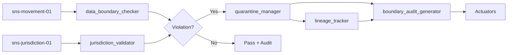
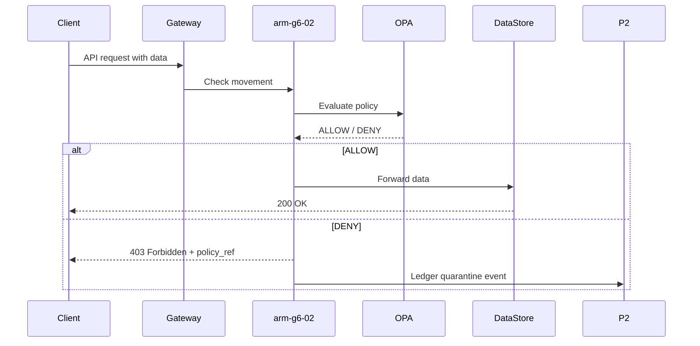

# ARM-G6-02: Data Boundary Enforcer

> **Arm ID:** `arm-g6-02`  
> **Persona:** G6 The Sentinel  
> **Type:** Primary Arm  
> **Critical Gate:** R-ARM-DATA-4 — PII never leaves its boundary  
> **Maturity Target:** L4 (H4) — automatic quarantine, self-driving enforcement  
> **Version:** 1.0.0  
> **Status:** Active  

---

## 1. Arm Manifest

```yaml
arm_manifest:
  arm_id: "arm-g6-02"
  name: "Data Boundary Enforcer"
  description: "Enforces data residency, jurisdiction, and boundary policies across all data movement channels. Checks data against boundary policies, quarantines violations before propagation, and generates data boundary audit reports. Interfaces with G1 Arbiter for compliance certification."
  persona: "G6 The Sentinel"
  tier: "primary"
  critical_gate: "R-ARM-DATA-4"
  enforcement_modes: ["preventive", "detective", "corrective"]
  policy_domains:
    - data_residency
    - jurisdiction
    - cross_border_transfer
    - encryption_at_rest
    - encryption_in_transit
    - access_control
    - retention_limit
  owner: "G6 The Sentinel"
  maintainer: "G1 The Arbiter"
  reviewer: "P3 The Hallucination Guard"
  status: "active"
  version: "1.0.0"
  created: "2026-07-01"
  last_updated: "2026-07-01"
```

---

## 2. Sensors

| Sensor ID | Type | Source | Data Captured | Frequency |
|-----------|------|--------|---------------|-----------|
| `sns-boundary-01` | Policy Sensor | OPA policy engine, DataGov API | Active policy rules, exceptions, whitelists | Real-time |
| `sns-movement-01` | Data Movement Sensor | API gateways, ETL pipelines, Kafka topics | Data egress/ingress events, transfer volumes | Real-time |
| `sns-jurisdiction-01` | Jurisdiction Sensor | GeoIP, cloud metadata, DNS records | Data location, replica regions, CDN endpoints | 5-min poll |
| `sns-access-01` | Access Sensor | Identity logs, Keycloak audit, Vault audit | Who accessed what data from where | Real-time |
| `sns-retention-01` | Retention Sensor | PostgreSQL, S3 lifecycle, Elasticsearch ILM | Data age, retention policy status, deletion queue | Hourly |

### Sensor Output Schema

```json
{
  "sensor_id": "sns-movement-01",
  "event_id": "evt-20260701-001",
  "timestamp": "2026-07-01T12:00:00Z",
  "data_source_id": "ds-analytics-db-001",
  "movement_type": "egress",
  "source_jurisdiction": "EU",
  "target_jurisdiction": "US",
  "target_service": "openrouter.api",
  "data_classification": "phi",
  "policy_rule_id": "pol-hipaa-003",
  "policy_violation": true,
  "volume_bytes": 15234,
  "user_id": "user-analytics-01"
}
```

---

## 3. Tools

| Tool ID | Name | Description | Execution Mode | Timeout | Retry |
|---------|------|-------------|---------------|---------|-------|
| `tool-boundary-01` | `data_boundary_checker` | Validates data movement against residency and jurisdiction rules | Sync | 200ms | 3x exponential |
| `tool-jurisdiction-01` | `jurisdiction_validator` | Resolves IP, region, cloud zone to jurisdiction with confidence score | Sync | 100ms | 3x exponential |
| `tool-quarantine-01` | `quarantine_manager` | Blocks, redirects, or isolates violating data streams | Sync | 500ms | 3x exponential |
| `tool-policy-01` | `policy_engine_query` | Queries OPA / DataGov for applicable policy rules | Sync | 50ms | 3x exponential |
| `tool-report-02` | `boundary_audit_generator` | Generates PDF + JSON boundary audit report with causal chain | Async | 60s | 2x exponential |
| `tool-lineage-01` | `lineage_tracker` | Traces data from source to destination across all hops | Async | 120s | 3x exponential |
| `tool-encrypt-01` | `encryption_validator` | Verifies encryption-at-rest and in-transit status | Sync | 100ms | 3x exponential |

### Tool Chaining Pattern



---

## 4. Skills

| Skill | Usage | Trigger | Evidence |
|-------|-------|---------|----------|
| `kimi-data-tools-v2` | Research jurisdiction law changes, GDPR adequacy decisions, new transfer mechanisms | Policy update required | Regulatory URL + summary |
| `kimi-webbridge` | Screenshot evidence of data in unauthorized cloud regions | Web-based admin console audit | PNG + URL |
| `deep-research-swarm` | Research cross-border data transfer frameworks, Schrems II implications, SCCs | Compliance ambiguity | Research brief |
| `report-writing` | Generate data boundary audit reports | Audit complete | PDF + JSON |
| `docx` | Generate compliance certificates for G1 Arbiter | Boundary audit passed | .docx certificate |
| `pdf` | Generate evidence packages for regulatory inspection | Audit requested | PDF evidence pack |

---

## 5. Memory

### 5.1 Short-Term Memory (STM)

Active boundary decision cache. TTL: 24h active, 7d recent.

```json
{
  "turn_id": "turn-20260701-002",
  "timestamp": "2026-07-01T12:00:00Z",
  "persona_id": "G6",
  "arm_id": "arm-g6-02",
  "data_source_id": "ds-analytics-backups",
  "pii_findings": [],
  "boundary_status": "violation_detected",
  "quarantine_action": "blocked_and_migrated",
  "confidence": 0.99,
  "tags": ["gdpr", "us_east_1", "eu_data", "s3_migration"]
}
```

### 5.2 Long-Term Memory (LTM)

Boundary policies, jurisdiction mappings, and exception registers.

```json
{
  "fact_id": "fact-boundary-001",
  "category": "boundary_policy",
  "key": "eu_data_no_us_transfer",
  "value": "{
    \"source_jurisdiction\": \"EU\",
    \"allowed_targets\": [\"EU\", \"EEA\", \"adequate\"],
    \"transfer_mechanism\": \"SCC+TIA\",
    \"exceptions\": [\"explicit_consent\", \"contract_necessity\"]
  }",
  "source": "DataGov_Policy_Engine",
  "timestamp": "2026-01-01T00:00:00Z",
  "confidence": 1.0,
  "expiry": null,
  "data_source_id": null,
  "pii_type": null,
  "jurisdiction": "EU",
  "retention_policy": "indefinite",
  "anonymization_method": null
}
```

### 5.3 Episodic Memory (EM)

Boundary enforcement episodes for trend analysis and compliance replay.

```json
{
  "session_id": "sess-20260701-002",
  "persona_id": "G6",
  "arm_id": "arm-g6-02",
  "data_source_id": "ds-analytics-backups",
  "start_time": "2026-07-01T12:00:00Z",
  "end_time": "2026-07-01T12:02:15Z",
  "scan_results": {
    "total_movements_checked": 152,
    "violations_detected": 14,
    "quarantined": 14,
    "migrated": 1
  },
  "boundary_violations": [
    {
      "type": "wrong_jurisdiction",
      "source": "eu-west-1",
      "target": "us-east-1",
      "data_class": "personal_data",
      "action": "blocked"
    }
  ],
  "quarantine_actions": ["blocked_14", "migrated_1"],
  "anonymization_summary": null,
  "embedding": [0.05, 0.12, ...],
  "compression_ratio": 0.12
}
```

---

## 6. Actuators

| Actuator ID | Name | Trigger | Action | Target |
|-------------|------|---------|--------|--------|
| `act-block-01` | Egress Block | Data movement violates jurisdiction | Block API call, return 403 | API Gateway |
| `act-migrate-01` | Auto-Migrate | Data in wrong region | Trigger S3 replication to compliant region | AWS/GCP/Azure API |
| `act-encrypt-01` | Encrypt-at-Rest | Unencrypted data detected | Trigger encryption job | Cloud KMS |
| `act-delete-01` | Expired Data Delete | Data exceeds retention policy | Queue for secure deletion | Data lifecycle manager |
| `act-notify-01` | Compliance Alert | Boundary violation detected | Notify DPO, G1, G6 operators | Slack / Email / PagerDuty |
| `act-certify-01` | Compliance Trigger | Audit complete, all boundaries clean | Request G1 compliance certification | `g6_to_g1_compliance_v1` |
| `act-ledger-01` | Quarantine Ledger | Quarantine action taken | Record in P2 immutable ledger | `g6_to_p2_ledger_v1` |

---

## 7. Circuit Breaker & Error Handling

### 7.1 Circuit Breaker Configuration

```yaml
circuit_breaker:
  name: "boundary_enforcer_cb"
  failure_threshold: 10
  success_threshold: 5
  recovery_timeout_ms: 15000
  half_open_max_calls: 3
  states:
    closed: "Normal enforcement — all policies active"
    open: "Policy engine unreachable — default DENY ALL"
    half_open: "Testing policy engine recovery"
  fallback:
    mode: "default_deny"
    action: "Block all cross-border data movement until policy engine recovers"
    notification: "CRITICAL: Boundary enforcement in default-deny mode. Alert D5 + G1."
```

### 7.2 Error Handling Matrix

| Error Type | Handling | Retry | Fallback | Evidence |
|------------|----------|-------|----------|----------|
| OPA timeout | Default deny, queue retry | 3x | Default-deny mode | Alert |
| Cloud API failure | Retry with exponential backoff | 5x | Manual ticket | Retry log |
| GeoIP ambiguity | Flag for human review | 0x | Hold movement | Review queue |
| Policy conflict | Escalate to G1 Arbiter | 0x | Hold decision | Escalation ticket |
| Encryption key unavailable | Queue for re-encryption | 3x | Manual key rotation | Key alert |
| False negative (post-hoc) | Trigger incident response | 0x | G2 investigation | Incident ticket |

---

## 8. Delegation & Escalation

| Condition | Delegate To | Hook | Timeout | Evidence |
|-----------|-----------|------|---------|----------|
| Boundary breach | G2 Red Team | `g6_to_g2_breach_v1` | 60s | Breach ticket |
| Compliance certification | G1 Arbiter | `g6_to_g1_compliance_v1` | 120s | Certificate |
| Quarantine event | P2 Ledger Keeper | `g6_to_p2_ledger_v1` | 30s | Ledger hash |
| Safe data ingestion | D4 Knowledge Curator | `g6_to_d4_knowledge_v1` | 300s | Ingestion receipt |
| Student data boundary | EdGuide Compliance | `g6_to_edguide_v1` | 30s | EdGuide alert |
| Encryption failure | D2 Security Architect | Direct notify | 15s | Security ticket |
| Cloud migration needed | D3 Delivery Captain | Task assignment | 300s | Jira ticket |

---

## 9. Policy Enforcement Modes

### 9.1 Preventive Mode (Default)



### 9.2 Detective Mode

Audit-only mode for policy validation before full enforcement. Used in staging and during policy rollouts.

### 9.3 Corrective Mode

Post-violation remediation: auto-migrate, re-encrypt, or delete data that has already crossed boundaries.

---

## 10. Quality Gates

- [ ] Pre-condition: Policy set loaded, OPA reachable, jurisdiction data fresh
- [ ] Post-condition: All movements checked, violations quarantined, audit trail complete
- [ ] Evidence: Every enforcement action backed by policy rule ID and timestamp
- [ ] P3 Review: 5% of boundary decisions verified by Hallucination Guard
- [ ] Ledger: All quarantine events recorded in P2 immutable ledger
- [ ] Audit: Boundary report includes causal chain, jurisdiction mapping, and remediation

---

**Document Owner:** GAI-OBSERVE Advisory Architecture Team  
**Classification:** Internal — Arm Specification  
**Next Review:** 2026-08-01
