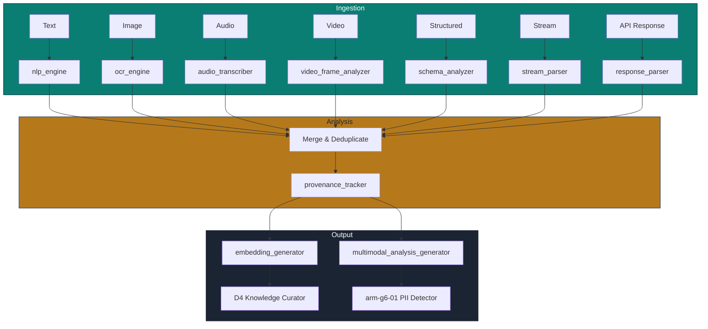

# ARM-G6-03: Multimodal Perceiver

> **Arm ID:** `arm-g6-03`  
> **Persona:** G6 The Sentinel  
> **Type:** Primary Arm  
> **Critical Gate:** R-ARM-DATA-2 — Lineage graph is queryable  
> **Maturity Target:** L4 (H4) — deterministic, provenance-tagged multimodal ingestion  
> **Version:** 1.0.0  
> **Status:** Active  

---

## 1. Arm Manifest

```yaml
arm_manifest:
  arm_id: "arm-g6-03"
  name: "Multimodal Perceiver"
  description: "Ingests all data modalities — text, images, audio, video, databases, streams, and API responses — and transforms them into analyzable, provenance-tagged segments. Runs OCR, transcription, frame analysis, NLP, and schema analysis. Detects sensitive content across all modalities and generates multimodal analysis reports. Interfaces with KnowledgeWorker for semantic indexing."
  persona: "G6 The Sentinel"
  tier: "primary"
  critical_gate: "R-ARM-DATA-2"
  modalities:
    - text
    - image
    - audio
    - video
    - structured
    - stream
    - api_response
  provenance: "hash-chained, timestamped, source-attributed"
  owner: "G6 The Sentinel"
  maintainer: "D4 The Knowledge Curator"
  reviewer: "P3 The Hallucination Guard"
  status: "active"
  version: "1.0.0"
  created: "2026-07-01"
  last_updated: "2026-07-01"
```

---

## 2. Sensors

| Sensor ID | Modality | Ingestion Method | Format Support | Throughput | Provenance |
|-----------|----------|------------------|---------------|------------|------------|
| `sns-text-02` | Text | File upload, API payload, webhook, Git hook | TXT, MD, JSON, JSONL, XML, HTML, PDF (text layer), DOCX | 20 MB/s | SHA-256 + Git commit hash |
| `sns-image-02` | Image | Upload, URL fetch, screenshot, scan | PNG, JPEG, TIFF, WebP, BMP, GIF, SVG | 100 images/min | SHA-256 + EXIF + source URL |
| `sns-audio-02` | Audio | Upload, stream capture, call recording | WAV, MP3, FLAC, OGG, M4A, WebM | 10 hours/min | SHA-256 + duration + device ID |
| `sns-video-02` | Video | Upload, stream capture, screen recording | MP4, AVI, MOV, WebM, MKV, FLV | 4 hours/min | SHA-256 + duration + frame count |
| `sns-structured-02` | Structured | DB connection, API query, file import | PostgreSQL, MySQL, CSV, XLSX, Parquet, ORC, Avro | 500K rows/s | Connection string hash + query hash |
| `sns-stream-02` | Stream | Kafka consumer, Kinesis, Pub/Sub, Event Hubs | Avro, Protobuf, JSON, CSV | 2M events/min | Offset + partition + topic |
| `sns-api-02` | API Response | HTTP intercept, proxy capture, webhook | JSON, XML, HTML, protobuf | 1000 req/s | Request ID + timestamp + endpoint |

### Sensor Output Schema (Unified Segment)

```json
{
  "segment_id": "seg-20260701-003",
  "sensor_id": "sns-image-02",
  "data_source_id": "ds-mri-docs-001",
  "timestamp": "2026-07-01T12:00:00Z",
  "modality": "image",
  "format": "JPEG",
  "raw_size_bytes": 2457600,
  "content_hash": "sha256:b4e1...",
  "provenance": {
    "source_type": "upload",
    "source_path": "/uploads/mri/patient_001.jpg",
    "uploader_id": "user-doc-01",
    "upload_timestamp": "2026-07-01T11:58:00Z",
    "exif_data": {
      "device": "GE_MRI_Scanner_3T",
      "timestamp": "2026-06-30T09:00:00Z",
      "gps": null
    }
  },
  "language_detected": null,
  "jurisdiction": "EU-GDPR",
  "policy_set_id": "pol-gdpr-hipaa-001",
  "preprocessing": {
    "ocr_text": "Patient: John Doe | DOB: 1985-03-15 | MRN: 12345678",
    "ocr_confidence": 0.94,
    "face_detected": false,
    "text_regions": 3
  }
}
```

---

## 3. Tools

| Tool ID | Name | Description | Execution Mode | Timeout | Retry |
|---------|------|-------------|---------------|---------|-------|
| `tool-ocr-02` | `ocr_engine` | Tesseract 5 + cloud OCR (AWS Textract, Azure Form Recognizer) for image-to-text extraction with bounding boxes | Async | 120s | 3x exponential |
| `tool-transcribe-02` | `audio_transcriber` | OpenAI Whisper + local Whisper.cpp for transcription with speaker diarization and timestamps | Async | 300s | 3x exponential |
| `tool-frame-02` | `video_frame_analyzer` | FFmpeg frame extraction + OCR + face detection + object detection (YOLO) | Async | 600s | 3x exponential |
| `tool-nlp-02` | `nlp_engine` | spaCy + transformers for NER, entity linking, sentiment, language detection | Sync | 30s | 3x exponential |
| `tool-schema-02` | `schema_analyzer` | SQLAlchemy introspection + Great Expectations for structured data profiling | Sync | 60s | 3x exponential |
| `tool-provenance-02` | `provenance_tracker` | Generates and verifies hash-chained provenance for every segment | Sync | 10s | 3x exponential |
| `tool-report-03` | `multimodal_analysis_generator` | Generates unified PDF + JSON report with modality breakdown and provenance | Async | 60s | 2x exponential |
| `tool-embed-02` | `embedding_generator` | Generates 128-dim embeddings for semantic indexing (sentence-transformers) | Async | 60s | 3x exponential |

### Modality Processing Pipeline



---

## 4. Skills

| Skill | Usage | Trigger | Evidence |
|-------|-------|---------|----------|
| `kimi-webbridge` | Capture screenshots of web-based data sources, DOM snapshots for provenance | Web data ingestion | PNG + DOM JSON |
| `kimi-data-tools-v2` | Fetch remote data sources, verify URLs, download datasets | URL-based ingestion | Download manifest |
| `batch-download` | Multi-file dataset ingestion for batch processing | Large dataset upload | File manifest + checksums |
| `report-writing` | Generate multimodal analysis reports | Analysis complete | PDF + JSON |
| `seaborn-visualization` | Visualize modality distribution, source breakdown, timeline | Reporting phase | PNG charts |
| `deep-research-swarm` | Research multimodal detection techniques, adversarial evasion | Detection gap identified | Research brief |

---

## 5. Memory

### 5.1 Short-Term Memory (STM)

Active ingestion session cache. TTL: 24h active, 7d recent.

```json
{
  "turn_id": "turn-20260701-003",
  "timestamp": "2026-07-01T12:00:00Z",
  "persona_id": "G6",
  "arm_id": "arm-g6-03",
  "data_source_id": "ds-mri-docs-001",
  "pii_findings": [
    {
      "modality": "image",
      "detection_method": "ocr_engine",
      "finding_type": "patient_name",
      "value_redacted": "[REDACTED-NAME]",
      "confidence": 0.94,
      "text_region": {"x": 45, "y": 120, "w": 200, "h": 30}
    }
  ],
  "boundary_status": "pending_check",
  "quarantine_action": null,
  "confidence": 0.94,
  "tags": ["phi", "image", "ocr", "mri"]
}
```

### 5.2 Long-Term Memory (LTM)

Data source profiles, modality schemas, and provenance templates.

```json
{
  "fact_id": "fact-source-001",
  "category": "data_source_profile",
  "key": "ds-mri-docs-001",
  "value": "{
    \"source_type\": \"image_collection\",
    \"modality\": \"image\",
    \"typical_formats\": [\"JPEG\", \"DICOM\"],
    \"pii_risk\": \"high\",
    \"ocr_quality\": 0.94,
    \"expected_fields\": [\"patient_name\", \"dob\", \"mrn\", \"study_date\"]
  }",
  "source": "multimodal_analysis_generator",
  "timestamp": "2026-07-01T00:00:00Z",
  "confidence": 0.94,
  "expiry": null,
  "data_source_id": "ds-mri-docs-001",
  "pii_type": "phi",
  "jurisdiction": "EU",
  "retention_policy": "7_years_medical",
  "anonymization_method": "dicom_deidentification"
}
```

### 5.3 Episodic Memory (EM)

Ingestion session history for replay and audit.

```json
{
  "session_id": "sess-20260701-003",
  "persona_id": "G6",
  "arm_id": "arm-g6-03",
  "data_source_id": "ds-mri-docs-001",
  "start_time": "2026-07-01T12:00:00Z",
  "end_time": "2026-07-01T12:08:45Z",
  "scan_results": {
    "total_segments": 45,
    "by_modality": {"image": 45, "text": 0, "audio": 0, "video": 0},
    "ocr_pages": 45,
    "ocr_text_extracted_kb": 1280,
    "schema_analyzed": false,
    "embeddings_generated": 45
  },
  "boundary_violations": [],
  "quarantine_actions": [],
  "anonymization_summary": null,
  "embedding": [0.08, -0.03, ...],
  "compression_ratio": 0.18
}
```

---

## 6. Actuators

| Actuator ID | Name | Trigger | Action | Target |
|-------------|------|---------|--------|--------|
| `act-index-01` | Semantic Index | Embeddings generated | Insert into pgvector / Qdrant | D4 Knowledge Curator |
| `act-route-01` | Modality Router | Segment processed | Route to appropriate detector (PII, secret, boundary) | arm-g6-01, arm-g6-02 |
| `act-archive-01` | Provenance Archive | Session complete | Store hash-chained provenance in PostgreSQL | P2 Ledger Keeper |
| `act-extract-01` | Metadata Extraction | File ingested | Extract EXIF, headers, schema metadata | Metadata store |
| `act-classify-01` | Auto-Classification | Content analyzed | Assign data classification label | Classification registry |
| `act-notify-02` | Ingestion Alert | High-risk data ingested | Alert operators | Slack / PagerDuty |

---

## 7. Circuit Breaker & Error Handling

### 7.1 Circuit Breaker Configuration

```yaml
circuit_breaker:
  name: "multimodal_perceiver_cb"
  failure_threshold: 8
  success_threshold: 4
  recovery_timeout_ms: 60000
  half_open_max_calls: 2
  states:
    closed: "Full multimodal processing active"
    open: "GPU/ML services down — fallback to text-only extraction"
    half_open: "Testing ML service recovery"
  fallback:
    mode: "text_fallback"
    action: "Skip OCR/frame analysis, use filename/metadata only, flag for manual review"
    notification: "Alert D5 SRE + G6 operator — multimodal processing degraded"
```

### 7.2 Error Handling Matrix

| Error Type | Handling | Retry | Fallback | Evidence |
|------------|----------|-------|----------|----------|
| OCR failure | Retry with cloud OCR | 3x | Skip image, flag for review | Retry log |
| Transcription timeout | Retry with shorter segments | 3x | Partial transcription | Timeout log |
| Video decode error | Retry with ffmpeg fallback | 2x | Skip video, extract audio only | Error log |
| Schema introspection failure | Use static schema definition | 0x | Limited analysis | Schema fallback log |
| Embedding generation failure | Retry with CPU model | 3x | Skip indexing | Degradation log |
| Provenance hash mismatch | Alert D2 + P2 | 0x | Manual investigation | Security alert |
| Memory exhaustion | Reduce batch size, stream process | 3x | Stream mode | Resource alert |

---

## 8. Delegation & Escalation

| Condition | Delegate To | Hook | Timeout | Evidence |
|-----------|-----------|------|---------|----------|
| PII detected in segment | arm-g6-01 PII Detector | Internal | 30s | Detection receipt |
| Boundary violation | arm-g6-02 Data Boundary Enforcer | Internal | 30s | Enforcement receipt |
| Semantic indexing | D4 Knowledge Curator | `g6_to_d4_knowledge_v1` | 300s | Index confirmation |
| Provenance anomaly | P2 Ledger Keeper | `g6_to_p2_ledger_v1` | 30s | Ledger entry |
| Adversarial evasion | G2 Red Team | `g6_to_g2_breach_v1` | 60s | Investigation ticket |
| Content moderation | EdGuide Compliance | `g6_to_edguide_v1` | 30s | EdGuide alert |
| Data source corruption | D3 Delivery Captain | Task assignment | 300s | Jira ticket |

---

## 9. Provenance & Lineage

Every segment processed by the Multimodal Perceiver carries a **hash-chained provenance record**:


### Provenance Schema

```json
{
  "provenance_id": "prov-20260701-003",
  "segment_id": "seg-20260701-003",
  "previous_hash": "sha256:a1b2...",
  "current_hash": "sha256:c3d4...",
  "timestamp": "2026-07-01T12:00:00Z",
  "actor": "arm-g6-03",
  "action": "ocr_extracted",
  "input_hash": "sha256:e5f6...",
  "output_hash": "sha256:g7h8...",
  "signature": "ed25519:..."
}
```

---

## 10. Quality Gates

- [ ] Pre-condition: Data source validated, format supported, sensor healthy
- [ ] Post-condition: All segments have provenance, embeddings, and modality classification
- [ ] Evidence: Every segment hash-verifiable, every OCR result has confidence score
- [ ] P3 Review: 2% of OCR findings and transcriptions spot-checked for accuracy
- [ ] Ledger: All provenance records recorded in P2 immutable ledger
- [ ] Audit: Multimodal report includes source breakdown, processing times, and error rates

---

**Document Owner:** GAI-OBSERVE Advisory Architecture Team  
**Classification:** Internal — Arm Specification  
**Next Review:** 2026-08-01
