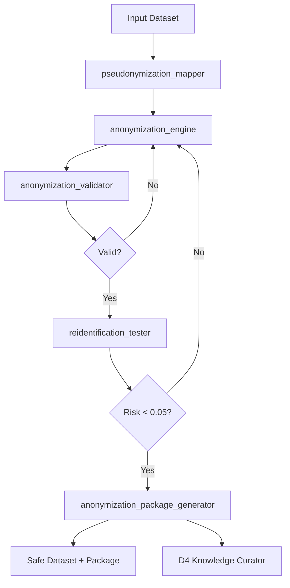

# ARM-G6-05: Anonymization Engine

> **Arm ID:** `arm-g6-05`  
> **Persona:** G6 The Sentinel  
> **Type:** Secondary Arm  
> **Critical Gate:** R-ARM-DATA-3 — Retention policy enforced; safe downstream processing  
> **Maturity Target:** L4 (H4) — automated anonymization with re-identification risk validation  
> **Version:** 1.0.0  
> **Status:** Active  

---

## 1. Arm Manifest

```yaml
arm_manifest:
  arm_id: "arm-g6-05"
  name: "Anonymization Engine"
  description: "Anonymizes and pseudonymizes datasets for safe downstream processing. Generates anonymization packages with schema, transformation logs, and re-identification risk validation. Produces safe datasets for LLM training, analytics, and cross-team collaboration. Interfaces with D4 Knowledge Curator for safe knowledge graph ingestion."
  persona: "G6 The Sentinel"
  tier: "secondary"
  critical_gate: "R-ARM-DATA-3"
  techniques:
    - k_anonymity
    - l_diversity
    - t_closeness
    - differential_privacy
    - pseudonymization
    - generalization
    - suppression
    - noise_injection
  reidentification_risk_threshold: 0.05
  owner: "G6 The Sentinel"
  maintainer: "D6 The Model Guardian"
  reviewer: "P3 The Hallucination Guard"
  status: "active"
  version: "1.0.0"
  created: "2026-07-01"
  last_updated: "2026-07-01"
```

---

## 2. Sensors

| Sensor ID | Type | Source | Trigger | Frequency |
|-----------|------|--------|---------|-----------|
| `sns-anon-01` | Dataset Sensor | PostgreSQL, CSV, Parquet, API response | Scheduled anonymization job or manual request | On-demand / Hourly |
| `sns-policy-02` | Anonymization Policy Sensor | DataGov API, OPA | Policy change requiring re-anonymization | Event-driven |
| `sns-risk-01` | Risk Threshold Sensor | Re-identification test results | Risk score exceeds threshold | Continuous |
| `sns-request-01` | Request Sensor | D4, D6, G4 analytics requests | Downstream team requests safe dataset | On-demand |

### Sensor Output Schema

```json
{
  "sensor_id": "sns-anon-01",
  "dataset_id": "ds-patient-records-001",
  "timestamp": "2026-07-01T12:00:00Z",
  "requestor_id": "D4-knowledge-curator",
  "requestor_persona": "D4",
  "purpose": "knowledge_graph_ingestion",
  "jurisdiction": "EU-GDPR",
  "original_schema": {
    "columns": ["patient_id", "name", "dob", "ssn", "diagnosis", "zip", "income"],
    "row_count": 50000,
    "size_bytes": 12400000
  },
  "required_techniques": ["pseudonymization", "k_anonymity", "generalization"],
  "risk_threshold": 0.05
}
```

---

## 3. Tools

| Tool ID | Name | Description | Execution Mode | Timeout | Retry |
|---------|------|-------------|---------------|---------|-------|
| `tool-anon-01` | `anonymization_engine` | Applies k-anonymity, l-diversity, t-closeness, differential privacy to structured datasets | Async | 600s | 3x exponential |
| `tool-pseudo-01` | `pseudonymization_mapper` | Generates reversible pseudonym mappings with secure key storage in Vault | Sync | 30s | 3x exponential |
| `tool-reid-01` | `reidentification_tester` | Runs re-identification attacks (uniqueness, linkage, inference) to validate anonymization effectiveness | Async | 300s | 3x exponential |
| `tool-schema-03` | `anonymization_schema_generator` | Generates transformed schema with transformation log and column lineage | Sync | 15s | 3x exponential |
| `tool-report-04` | `anonymization_package_generator` | Bundles dataset, schema, log, risk report, and usage agreement into a signed package | Async | 60s | 2x exponential |
| `tool-diffpriv-01` | `differential_privacy_engine` | Applies epsilon-differential privacy with configurable epsilon and delta | Async | 300s | 3x exponential |
| `tool-validate-01` | `anonymization_validator` | Validates output dataset against schema, completeness, and utility thresholds | Sync | 30s | 3x exponential |

### Anonymization Pipeline



---

## 4. Skills

| Skill | Usage | Trigger | Evidence |
|-------|-------|---------|----------|
| `swarm-coding` | Build and deploy custom anonymization pipelines for novel data types | New dataset type encountered | Pipeline code + tests |
| `report-writing` | Generate anonymization audit reports with risk analysis and utility metrics | Package complete | PDF + JSON |
| `kimi-data-tools-v2` | Research latest anonymization techniques, differential privacy advances, regulatory guidance | Technique gap identified | Research brief |
| `deep-research-swarm` | Deep research on re-identification attacks, linkage risks, adversarial anonymization | Risk threshold exceeded | Research brief |
| `seaborn-visualization` | Visualize risk distributions, k-anonymity histograms, utility preservation charts | Reporting phase | PNG charts |
| `xlsx` | Generate Excel-based anonymization logs and transformation trackers | Customer request | .xlsx file |
| `docx` | Generate data processing agreements and anonymization certificates | Compliance requirement | .docx document |
| `pdf` | Generate signed anonymization packages for regulatory submission | Audit request | PDF package |

---

## 5. Memory

### 5.1 Short-Term Memory (STM)

Active anonymization job cache. TTL: 24h active, 7d recent.

```json
{
  "turn_id": "turn-20260701-004",
  "timestamp": "2026-07-01T12:00:00Z",
  "persona_id": "G6",
  "arm_id": "arm-g6-05",
  "data_source_id": "ds-patient-records-001",
  "pii_findings": null,
  "boundary_status": "anonymized",
  "quarantine_action": null,
  "confidence": 0.97,
  "tags": ["anonymization", "k_anonymity", "pseudonymization", "knowledge_graph"]
}
```

### 5.2 Long-Term Memory (LTM)

Anonymization maps, transformation rules, and pseudonym key references (keys stored in Vault, references only in LTM).

```json
{
  "fact_id": "fact-anon-001",
  "category": "anonymization_map",
  "key": "ds-patient-records-001-v2",
  "value": "{
    \"pseudonymization_key\": \"vault://keys/pseudo-001\",
    \"k_anonymity_k\": 5,
    \"l_diversity_l\": 2,
    \"generalization_rules\": {
      \"age\": \"bin_10_years\",
      \"zip\": \"first_3_digits\",
      \"income\": \"bin_quintile\"
    },
    \"suppressed_columns\": [\"name\", \"ssn\"],
    \"differential_privacy_epsilon\": 0.1
  }",
  "source": "anonymization_engine",
  "timestamp": "2026-07-01T12:00:00Z",
  "confidence": 0.97,
  "expiry": "2027-07-01T00:00:00Z",
  "data_source_id": "ds-patient-records-001",
  "pii_type": null,
  "jurisdiction": "EU",
  "retention_policy": "1_year_anonymization_maps",
  "anonymization_method": "k_anonymity_pseudonymization"
}
```

### 5.3 Episodic Memory (EM)

Anonymization job history for audit and trend analysis.

```json
{
  "session_id": "sess-20260701-004",
  "persona_id": "G6",
  "arm_id": "arm-g6-05",
  "data_source_id": "ds-patient-records-001",
  "start_time": "2026-07-01T12:00:00Z",
  "end_time": "2026-07-01T12:15:30Z",
  "scan_results": {
    "original_rows": 50000,
    "anonymized_rows": 50000,
    "columns_transformed": 5,
    "columns_suppressed": 2,
    "k_anonymity_achieved": 5,
    "reidentification_risk": 0.03
  },
  "boundary_violations": [],
  "quarantine_actions": [],
  "anonymization_summary": {
    "techniques_applied": ["pseudonymization", "k_anonymity", "generalization"],
    "utility_score": 0.92,
    "risk_score": 0.03,
    "package_id": "pkg-anon-20260701-004"
  },
  "embedding": [0.02, 0.08, ...],
  "compression_ratio": 0.10
}
```

---

## 6. Actuators

| Actuator ID | Name | Trigger | Action | Target |
|-------------|------|---------|--------|--------|
| `act-package-01` | Package Delivery | Anonymization complete | Deliver signed package to requestor | D4, D6, or customer |
| `act-index-02` | Safe Index | Anonymized dataset approved | Insert into D4 knowledge graph | D4 Knowledge Curator |
| `act-map-01` | Pseudonym Map Store | Pseudonymization applied | Store key in Vault, reference in LTM | HashiCorp Vault |
| `act-notify-03` | Risk Alert | Re-identification risk > 0.05 | Alert operators, reject package | G6 operator |
| `act-delete-02` | Key Deletion | Retention period expired | Securely delete pseudonym keys | Vault + key ceremony |
| `act-certify-02` | Utility Certification | Utility score > 0.85 | Mark dataset as analytics-ready | Data catalog |

---

## 7. Circuit Breaker & Error Handling

### 7.1 Circuit Breaker Configuration

```yaml
circuit_breaker:
  name: "anonymization_engine_cb"
  failure_threshold: 5
  success_threshold: 3
  recovery_timeout_ms: 30000
  half_open_max_calls: 2
  states:
    closed: "Full anonymization pipeline active"
    open: "Anonymization service failure — reject all requests"
    half_open: "Testing service recovery"
  fallback:
    mode: "reject_and_queue"
    action: "Reject anonymization request, queue for manual review by D6"
    notification: "Alert D6 Model Guardian + G6 operator"
```

### 7.2 Error Handling Matrix

| Error Type | Handling | Retry | Fallback | Evidence |
|------------|----------|-------|----------|----------|
| K-anonymity not achievable | Reduce k, increase generalization, suppress | 3x | Higher suppression | Transformation log |
| Re-identification risk too high | Apply differential privacy, add noise | 3x | Reject dataset | Risk report |
| Utility score too low | Reduce generalization, adjust bins | 3x | Partial anonymization | Utility report |
| Vault key store failure | Retry key generation | 3x | Manual key injection | Security alert |
| Schema mismatch | Validate and remap | 3x | Manual schema review | Schema error log |
| Dataset too large | Shard and process in parallel | 3x | Stream processing | Performance log |
| Pseudonym collision | Regenerate with larger entropy | 3x | UUID v4 fallback | Collision log |

---

## 8. Delegation & Escalation

| Condition | Delegate To | Hook | Timeout | Evidence |
|-----------|-----------|------|---------|----------|
| Anonymized dataset ready | D4 Knowledge Curator | `g6_to_d4_knowledge_v1` | 300s | Ingestion receipt |
| Re-identification risk high | D6 Model Guardian | Direct notify | 30s | Risk alert |
| Utility score low | D6 Model Guardian | Direct notify | 30s | Utility alert |
| Regulatory ambiguity | G1 Arbiter | `g6_to_g1_compliance_v1` | 120s | Compliance query |
| Package delivery | Customer / downstream persona | Direct delivery | 60s | Delivery receipt |
| Key rotation needed | D2 Security Architect | Direct notify | 15s | Security ticket |

---

## 9. Anonymization Package Format

Every anonymization job produces a **signed package** with the following structure:

```
pkg-anon-20260701-004/
├── MANIFEST.json          # Package metadata, signatures, checksums
├── DATA/
│   ├── anonymized.csv     # Safe dataset (CSV, Parquet, or JSONL)
│   ├── schema.json        # Transformed schema with column lineage
│   └── sample.json        # 5 sample rows for validation
├── LOGS/
│   ├── transformation.log  # Every transformation applied, with rule ID
│   ├── pseudonym_map.json  # Reference to Vault key (not the key itself)
│   └── provenance.json     # Hash chain of all operations
├── REPORTS/
│   ├── risk_report.json    # Re-identification risk analysis
│   ├── utility_report.json # Data utility preservation metrics
│   └── audit_report.pdf    # Human-readable audit report
└── AGREEMENTS/
    └── data_processing_agreement.pdf  # DPA for downstream use
```

### Package Manifest Schema

```json
{
  "package_id": "pkg-anon-20260701-004",
  "dataset_id": "ds-patient-records-001",
  "created_at": "2026-07-01T12:15:30Z",
  "created_by": "arm-g6-05",
  "signature": "ed25519:...",
  "checksums": {
    "anonymized.csv": "sha256:...",
    "schema.json": "sha256:..."
  },
  "risk_score": 0.03,
  "utility_score": 0.92,
  "compliance_frameworks": ["GDPR", "HIPAA"],
  "retention_until": "2027-07-01T00:00:00Z"
}
```

---

## 10. Quality Gates

- [ ] Pre-condition: Input dataset validated, schema parsed, risk threshold defined
- [ ] Post-condition: K-anonymity >= requested k, re-identification risk < 0.05, utility > 0.85
- [ ] Evidence: Every transformation logged with rule ID, before/after samples, and timestamp
- [ ] P3 Review: 5% of anonymized datasets spot-checked for re-identification risk
- [ ] Ledger: All anonymization events recorded in P2 immutable ledger
- [ ] Audit: Package includes signed manifest, risk report, and DPA

---

**Document Owner:** GAI-OBSERVE Advisory Architecture Team  
**Classification:** Internal — Arm Specification  
**Next Review:** 2026-08-01
