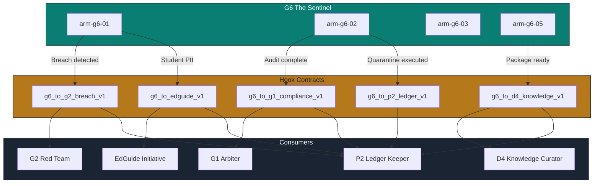

# G6 The Sentinel — Hook Contracts

> **Persona:** G6 The Sentinel  
> **Version:** 1.0.0  
> **Date:** 2026-07-01  
> **Source Strategy:** `C:\KimiWork Projects\GAI-OBSERVE-DESIGN\skills-hooks-plugins-strategy\STRATEGY.md`  
> **Governance Nexus:** `C:\KimiWork Projects\GAI-OBSERVE-DESIGN\skills-hooks-plugins-strategy\INITIATIVE_07_GOVERNANCENEXUS_AUGMENTATION.md`  
> **EdGuide:** `C:\KimiWork Projects\GAI-OBSERVE-DESIGN\skills-hooks-plugins-strategy\EDUGAI_AUGMENTATION.md`  

---

## 1. Registry Overview

This document defines the **5 integration hook contracts** for G6 The Sentinel. Each hook is a **typed, versioned, auditable contract** governing cross-persona data flow, transformation, error handling, and compliance. All hooks follow the GAI-OBSERVE hook contract template defined in the master strategy (`STRATEGY.md`, Section 7.3).

Hook contracts are enforced by:
- **Schema validation:** Pydantic v2 models
- **Auth:** JWT RS256 + role-based binding
- **Audit:** Every invocation recorded in P2 Ledger Keeper
- **Retry:** Exponential backoff with circuit breaker
- **PII handling:** Redaction at serialization boundary

---

## 2. Hook Contract: `g6_to_g2_breach_v1`

### 2.1 Contract Definition

```yaml
hook:
  id: "g6_to_g2_breach_v1"
  name: "G6 Data Violation → G2 Red Team Breach Investigation"
  version: "1.0.0"
  type: "cross_persona_security"
  classification: "security_critical"
  trigger:
    event: "quarantine_violation_detected"
    source: "arm-g6-02"
    filter:
      - "violation_type in ['phi_in_llm_prompt', 'pii_in_public_repo', 'secret_in_code', 'unencrypted_phi_storage']"
      - "confidence >= 0.95"
    debounce:
      window_ms: 5000
      max_events: 1
      strategy: "deduplicate_by_data_source"
  participants:
    - id: "G6"
      role: "producer"
      type: "persona"
      required: true
    - id: "G2"
      role: "consumer"
      type: "persona"
      required: true
    - id: "P2"
      role: "ledger"
      type: "persona"
      required: true
    - id: "D2"
      role: "validator"
      type: "persona"
      required: false
  data:
    input_schema: "g6/g2_breach_input_v1.json"
    input:
      event_id: "evt-20260701-001"
      data_source_id: "ds-api-logs-001"
      violation_type: "phi_in_llm_prompt"
      detected_at: "2026-07-01T12:00:00Z"
      detected_by: "arm-g6-01"
      confidence: 0.98
      pii_summary:
        - type: "patient_name"
          count: 23
          redacted_sample: "[REDACTED-NAME]"
        - type: "ssn"
          count: 12
          redacted_sample: "[REDACTED-SSN]"
      boundary_violation:
        source_jurisdiction: "US"
        target_jurisdiction: "US"
        target_service: "openrouter.api"
        policy_rule_id: "pol-hipaa-003"
      quarantine_action:
        action_id: "act-20260701-001"
        action_type: "blocked"
        affected_records: 23
        executed_at: "2026-07-01T12:00:05Z"
      lineage:
        - hop: 1
          source: "api_gateway"
          timestamp: "2026-07-01T11:58:00Z"
        - hop: 2
          source: "log_ingestion"
          timestamp: "2026-07-01T11:59:00Z"
        - hop: 3
          source: "llm_pipeline"
          timestamp: "2026-07-01T12:00:00Z"
      evidence_package:
        pii_report_hash: "sha256:abc..."
        boundary_report_hash: "sha256:def..."
        screenshot_hash: "sha256:ghi..."
    output_schema: "g6/g2_breach_output_v1.json"
    output:
      investigation_id: "inv-20260701-001"
      status: "opened"
      assigned_to: "G2"
      priority: "P1"
      classification: "potential_breach"
      response_sla_hours: 24
      ledger_hash: "sha256:p2hash..."
      next_steps:
        - "Scope impact assessment"
        - "Verify quarantine completeness"
        - "Check for historical occurrences"
      g2_acknowledged_at: "2026-07-01T12:01:00Z"
    transform: "G6 violation event → PII redaction → severity scoring → G2 investigation ticket → P2 ledger entry → G2 acknowledgement"
  quality:
    timeout_ms: 60000
    retry:
      policy: "exponential_backoff"
      max_attempts: 5
      base_delay_ms: 1000
      max_delay_ms: 30000
    circuit_breaker:
      threshold: 3
      recovery_timeout_ms: 30000
      fallback: "queue_for_manual_escalation"
    idempotency_key: "event_id"
  compliance:
    audit_level: "full_payload"
    required_signatures: ["G6", "G2", "P2"]
    pii_handling: "redact_all_values"
    retention_years: 7
    encryption: "AES-256-GCM"
    ledger_entry: true
  error_handling:
    G2_UNAVAILABLE:
      action: "queue_for_retry"
      max_queue_time_hours: 2
      escalation: "D5 SRE Commander"
    P2_LEDGER_FAILURE:
      action: "log_locally_and_retry"
      max_queue_time_hours: 24
      escalation: "D5 SRE Commander"
    VALIDATION_FAILURE:
      action: "reject_and_alert"
      escalation: "G6 operator + D9 Forward Engineer"
    TIMEOUT:
      action: "partial_delivery"
      deliver_to: "G2 queue"
      alert: "D5 SRE Commander"
```

---

## 3. Hook Contract: `g6_to_g1_compliance_v1`

### 3.1 Contract Definition

```yaml
hook:
  id: "g6_to_g1_compliance_v1"
  name: "G6 Boundary Audit → G1 Arbiter Compliance Certification"
  version: "1.0.0"
  type: "cross_persona_compliance"
  classification: "compliance_critical"
  trigger:
    event: "boundary_audit_complete"
    source: "arm-g6-02"
    filter:
      - "all_boundaries_checked == true"
      - "violations_count == 0 or all_violations_remediated == true"
      - "audit_scope in ['gdpr', 'hipaa', 'ccpa', 'soc2']"
    debounce:
      window_ms: 10000
      max_events: 1
      strategy: "latest_only"
  participants:
    - id: "G6"
      role: "producer"
      type: "persona"
      required: true
    - id: "G1"
      role: "consumer"
      type: "persona"
      required: true
    - id: "P2"
      role: "ledger"
      type: "persona"
      required: true
    - id: "P3"
      role: "verifier"
      type: "persona"
      required: false
  data:
    input_schema: "g6/g1_compliance_input_v1.json"
    input:
      audit_id: "audit-20260701-001"
      audit_type: "data_boundary"
      scope:
        framework: "GDPR"
        jurisdiction: "EU"
        data_sources: 37
        effective_date: "2026-07-01T00:00:00Z"
      findings:
        total_sources: 37
        compliant_sources: 37
        violations_found: 0
        violations_remediated: 0
        encryption_at_rest: 37
        encryption_in_transit: 37
        access_controls: 37
        retention_compliance: 37
      evidence:
        boundary_report_hash: "sha256:abc..."
        lineage_report_hash: "sha256:def..."
        retention_report_hash: "sha256:ghi..."
        scan_logs_hash: "sha256:jkl..."
      certifications:
        previous_certifications: ["cert-20260101-001"]
        renewal: true
        expiry_date: "2026-12-31T23:59:59Z"
      requestor: "G6 The Sentinel"
      requested_at: "2026-07-01T12:00:00Z"
    output_schema: "g6/g1_compliance_output_v1.json"
    output:
      certificate_id: "cert-20260701-001"
      status: "issued"
      framework: "GDPR"
      scope: "EU data boundary enforcement"
      validity_period:
        start: "2026-07-01T00:00:00Z"
        end: "2026-12-31T23:59:59Z"
      conditions: []
      exceptions: []
      g1_signature: "ed25519:..."
      p2_ledger_hash: "sha256:p2hash..."
      issued_at: "2026-07-01T12:05:00Z"
      next_audit_due: "2026-10-01T00:00:00Z"
    transform: "G6 audit package → P3 verification (optional) → G1 review → compliance certificate → P2 ledger → certificate delivery"
  quality:
    timeout_ms: 120000
    retry:
      policy: "exponential_backoff"
      max_attempts: 3
      base_delay_ms: 2000
      max_delay_ms: 60000
    circuit_breaker:
      threshold: 3
      recovery_timeout_ms: 60000
      fallback: "queue_for_manual_review"
    idempotency_key: "audit_id"
  compliance:
    audit_level: "full_payload"
    required_signatures: ["G6", "G1", "P2"]
    pii_handling: "redact_all_values"
    retention_years: 7
    encryption: "AES-256-GCM"
    ledger_entry: true
  error_handling:
    G1_UNAVAILABLE:
      action: "queue_for_retry"
      max_queue_time_hours: 4
      escalation: "G7 Mesh Weaver"
    P3_VERIFICATION_FAILURE:
      action: "hold_for_review"
      escalation: "G1 Arbiter"
    P2_LEDGER_FAILURE:
      action: "log_locally_and_retry"
      max_queue_time_hours: 24
      escalation: "D5 SRE Commander"
    AUDIT_EVIDENCE_INCOMPLETE:
      action: "reject_and_request"
      return_to: "G6"
      alert: "G6 operator"
```

---

## 4. Hook Contract: `g6_to_p2_ledger_v1`

### 4.1 Contract Definition

```yaml
hook:
  id: "g6_to_p2_ledger_v1"
  name: "G6 Quarantine Event → P2 Immutable Ledger"
  version: "1.0.0"
  type: "cross_persona_audit"
  classification: "audit_critical"
  trigger:
    event: "quarantine_action_executed"
    source: "arm-g6-02"
    filter:
      - "action_status in ['blocked', 'migrated', 'encrypted', 'deleted']"
      - "action_id is not null"
    debounce:
      window_ms: 1000
      max_events: 100
      strategy: "batch_by_window"
  participants:
    - id: "G6"
      role: "producer"
      type: "persona"
      required: true
    - id: "P2"
      role: "consumer"
      type: "persona"
      required: true
    - id: "G1"
      role: "observer"
      type: "persona"
      required: false
  data:
    input_schema: "g6/p2_ledger_input_v1.json"
    input:
      ledger_event_id: "le-20260701-001"
      event_type: "quarantine"
      action_id: "act-20260701-001"
      data_source_id: "ds-api-logs-001"
      arm_id: "arm-g6-02"
      triggered_by: "arm-g6-01"
      action:
        type: "blocked"
        reason: "phi_in_llm_prompt"
        policy_rule_id: "pol-hipaa-003"
        affected_records: 23
        source_jurisdiction: "US"
        target_jurisdiction: "US"
        target_service: "openrouter.api"
      pii_summary:
        - type: "patient_name"
          count: 23
          redacted: true
        - type: "ssn"
          count: 12
          redacted: true
      timestamp: "2026-07-01T12:00:05Z"
      actor: "G6 The Sentinel"
      previous_hash: "sha256:prev..."
      nonce: "uuid-v4"
    output_schema: "g6/p2_ledger_output_v1.json"
    output:
      ledger_entry_id: "le-20260701-001"
      status: "committed"
      block_hash: "sha256:block..."
      previous_hash: "sha256:prev..."
      timestamp: "2026-07-01T12:00:06Z"
      signature: "ed25519:..."
      confirmations: 1
      replication_status: "replicated_to_3_nodes"
    transform: "G6 quarantine event → PII redaction → hash calculation → cryptographic signing → append to hash chain → replicate → confirmation"
  quality:
    timeout_ms: 30000
    retry:
      policy: "exponential_backoff"
      max_attempts: 10
      base_delay_ms: 500
      max_delay_ms: 15000
    circuit_breaker:
      threshold: 5
      recovery_timeout_ms: 15000
      fallback: "local_queue_with_checksum"
    idempotency_key: "ledger_event_id"
  compliance:
    audit_level: "full_payload"
    required_signatures: ["G6", "P2"]
    pii_handling: "redact_all_values"
    retention_years: 7
    encryption: "AES-256-GCM"
    ledger_entry: true
    immutability: "hash_chained_append_only"
  error_handling:
    P2_UNAVAILABLE:
      action: "local_queue_with_checksum"
      max_queue_time_hours: 24
      escalation: "D5 SRE Commander"
      recovery: "replay_queue_on_recovery"
    HASH_MISMATCH:
      action: "retry_with_new_nonce"
      max_attempts: 3
      escalation: "D2 Security Architect"
    SIGNATURE_FAILURE:
      action: "alert_and_retry"
      escalation: "D2 Security Architect"
    REPLICATION_FAILURE:
      action: "retry_replication"
      max_attempts: 5
      escalation: "D5 SRE Commander"
```

---

## 5. Hook Contract: `g6_to_d4_knowledge_v1`

### 5.1 Contract Definition

```yaml
hook:
  id: "g6_to_d4_knowledge_v1"
  name: "G6 Anonymized Data → D4 Knowledge Curator Safe Ingestion"
  version: "1.0.0"
  type: "cross_persona_knowledge"
  classification: "knowledge_flow"
  trigger:
    event: "anonymization_package_complete"
    source: "arm-g6-05"
    filter:
      - "risk_score < 0.05"
      - "utility_score > 0.85"
      - "package_signed == true"
      - "package_validation == true"
    debounce:
      window_ms: 30000
      max_events: 10
      strategy: "batch_by_dataset_id"
  participants:
    - id: "G6"
      role: "producer"
      type: "persona"
      required: true
    - id: "D4"
      role: "consumer"
      type: "persona"
      required: true
    - id: "P2"
      role: "ledger"
      type: "persona"
      required: true
    - id: "P3"
      role: "verifier"
      type: "persona"
      required: false
  data:
    input_schema: "g6/d4_knowledge_input_v1.json"
    input:
      package_id: "pkg-anon-20260701-004"
      dataset_id: "ds-patient-records-001"
      anonymized_dataset:
        format: "parquet"
        location: "s3://sentinel-anonymized/pkg-anon-20260701-004/anonymized.parquet"
        checksum: "sha256:abc..."
        row_count: 50000
        column_count: 5
      schema:
        location: "s3://sentinel-anonymized/pkg-anon-20260701-004/schema.json"
        checksum: "sha256:def..."
      transformation_log:
        location: "s3://sentinel-anonymized/pkg-anon-20260701-004/transformation.log"
        checksum: "sha256:ghi..."
      risk_report:
        risk_score: 0.03
        attack_results: [{"attack_type": "linkage", "success_rate": 0.02}]
        below_threshold: true
      utility_report:
        utility_score: 0.92
        metrics: [{"metric": "mean_preservation", "score": 0.95}]
      provenance:
        chain_hash: "sha256:chain..."
        signature: "ed25519:..."
      requestor:
        persona_id: "D4"
        purpose: "knowledge_graph_ingestion"
        jurisdiction: "EU-GDPR"
      created_at: "2026-07-01T12:15:30Z"
    output_schema: "g6/d4_knowledge_output_v1.json"
    output:
      ingestion_id: "ing-20260701-004"
      status: "ingested"
      knowledge_graph_node_id: "kg-node-12345"
      embedding_index: "qdrant://sentinel-safe-index"
      searchable: true
      d4_acknowledged_at: "2026-07-01T12:20:00Z"
      p2_ledger_hash: "sha256:p2hash..."
      usage_restrictions:
        - "No re-identification attempts"
        - "No cross-dataset linkage without G6 approval"
        - "Retention until 2027-07-01"
      audit_trail:
        - "package_received: 2026-07-01T12:16:00Z"
        - "validation_passed: 2026-07-01T12:17:00Z"
        - "ingestion_complete: 2026-07-01T12:20:00Z"
    transform: "G6 anonymization package → D4 validation → P3 spot-check (optional) → D4 knowledge graph ingestion → embedding index → P2 ledger → usage restrictions applied"
  quality:
    timeout_ms: 300000
    retry:
      policy: "exponential_backoff"
      max_attempts: 3
      base_delay_ms: 5000
      max_delay_ms: 60000
    circuit_breaker:
      threshold: 3
      recovery_timeout_ms: 60000
      fallback: "queue_for_manual_ingestion"
    idempotency_key: "package_id"
  compliance:
    audit_level: "full_payload"
    required_signatures: ["G6", "D4", "P2"]
    pii_handling: "package_already_anonymized"
    retention_years: 1
    encryption: "AES-256-GCM"
    ledger_entry: true
  error_handling:
    D4_UNAVAILABLE:
      action: "queue_for_retry"
      max_queue_time_hours: 12
      escalation: "D5 SRE Commander"
    VALIDATION_FAILURE:
      action: "reject_and_return"
      return_to: "G6"
      reason: "D4 validation failed — package rejected"
      alert: "G6 operator"
    P3_VERIFICATION_FAILURE:
      action: "hold_for_review"
      escalation: "G6 operator"
      condition: "P3 spot-check found re-identification risk"
    INGESTION_TIMEOUT:
      action: "partial_ingestion"
      deliver_to: "D4 queue"
      alert: "D5 SRE Commander"
```

---

## 6. Hook Contract: `g6_to_edguide_v1`

### 6.1 Contract Definition

```yaml
hook:
  id: "g6_to_edguide_v1"
  name: "G6 Student PII → EdGuide Data Protection Compliance"
  version: "1.0.0"
  type: "cross_initiative_compliance"
  classification: "privacy_critical"
  trigger:
    event: "student_pii_detected"
    source: "arm-g6-01"
    filter:
      - "data_source_id starts with 'edguide-'"
      - "pii_type in ['student_name', 'student_email', 'student_id', 'parent_contact', 'grade_record']"
      - "confidence >= 0.90"
    debounce:
      window_ms: 5000
      max_events: 5
      strategy: "batch_by_module"
  participants:
    - id: "G6"
      role: "producer"
      type: "persona"
      required: true
    - id: "EdGuide"
      role: "consumer"
      type: "initiative"
      required: true
    - id: "G1"
      role: "validator"
      type: "persona"
      required: false
    - id: "P2"
      role: "ledger"
      type: "persona"
      required: true
    - id: "D4"
      role: "consumer"
      type: "persona"
      required: false
  data:
    input_schema: "g6/edguide_input_v1.json"
    input:
      alert_id: "alert-edguide-20260701-001"
      module: "AI_Tutor"
      data_source_id: "edguide-ai-tutor-prompts"
      detected_at: "2026-07-01T12:00:00Z"
      detected_by: "arm-g6-01"
      pii_findings:
        - type: "student_name"
          count: 3
          redacted_samples: ["[REDACTED-NAME]", "[REDACTED-NAME]", "[REDACTED-NAME]"]
          confidence: 0.95
        - type: "student_email"
          count: 2
          redacted_samples: ["[REDACTED-EMAIL]", "[REDACTED-EMAIL]"]
          confidence: 0.97
      context:
        prompt_type: "tutoring_question"
        llm_model: "ollama/llama3"
        local_inference: true
        data_residency: "EU"
      quarantine_recommendation:
        action: "redact_and_retrain"
        reason: "student_pii_in_prompt_history"
        policy_rule_id: "pol-edguide-privacy-001"
      edguide_module_owner: "D4 The Knowledge Curator"
      severity: "high"
    output_schema: "g6/edguide_output_v1.json"
    output:
      response_id: "resp-edguide-20260701-001"
      status: "acknowledged"
      module: "AI_Tutor"
      action_taken:
        - "prompt_history_redacted"
        - "ollama_cache_purged"
        - "D4_notified_for_retraining"
      edguide_compliance_status: "compliant_after_remediation"
      g1_review_required: false
      p2_ledger_hash: "sha256:p2hash..."
      next_steps:
        - "Verify prompt template PII filtering"
        - "Update AI Tutor system prompt"
        - "Schedule D4 retraining"
      completed_at: "2026-07-01T12:10:00Z"
    transform: "G6 student PII detection → PII redaction → EdGuide module alert → module-specific remediation → P2 ledger → compliance status update"
  quality:
    timeout_ms: 120000
    retry:
      policy: "exponential_backoff"
      max_attempts: 5
      base_delay_ms: 1000
      max_delay_ms: 30000
    circuit_breaker:
      threshold: 3
      recovery_timeout_ms: 30000
      fallback: "email_alert_to_edguide_admin"
    idempotency_key: "alert_id"
  compliance:
    audit_level: "full_payload"
    required_signatures: ["G6", "EdGuide", "P2"]
    pii_handling: "redact_all_values"
    retention_years: 7
    encryption: "AES-256-GCM"
    ledger_entry: true
    regulatory_framework: "GDPR + FERPA (student data)"
  error_handling:
    EDGUIDE_UNAVAILABLE:
      action: "email_alert_to_edguide_admin"
      max_queue_time_hours: 2
      escalation: "D3 Delivery Captain"
    G1_REVIEW_REQUIRED:
      action: "hold_for_g1"
      condition: "FERPA breach suspected"
      max_queue_time_hours: 24
      escalation: "G1 Arbiter"
    PROMPT_HISTORY_PURGE_FAILURE:
      action: "manual_purge_required"
      escalation: "EdGuide SRE + D5 SRE Commander"
    RETRAINING_SCHEDULE_FAILURE:
      action: "queue_for_manual_scheduling"
      escalation: "D3 Delivery Captain"
```

---

## 7. Hook Execution Architecture



---

## 8. Hook Summary Table

| Hook ID | From | To | Trigger | Payload Size | Timeout | PII Handling | Signatures Required |
|---------|------|----|---------|--------------|---------|------------|-------------------|
| `g6_to_g2_breach_v1` | G6 | G2 | Quarantine violation | < 1 MB | 60s | Redact all | G6, G2, P2 |
| `g6_to_g1_compliance_v1` | G6 | G1 | Boundary audit complete | < 500 KB | 120s | Redact all | G6, G1, P2 |
| `g6_to_p2_ledger_v1` | G6 | P2 | Quarantine action | < 100 KB | 30s | Redact all | G6, P2 |
| `g6_to_d4_knowledge_v1` | G6 | D4 | Anonymization package | < 10 MB | 300s | Already anonymized | G6, D4, P2 |
| `g6_to_edguide_v1` | G6 | EdGuide | Student PII detected | < 500 KB | 120s | Redact all | G6, EdGuide, P2 |

---

**Document Owner:** GAI-OBSERVE Advisory Architecture Team  
**Classification:** Internal — Hook Contracts  
**Next Review:** 2026-08-01
