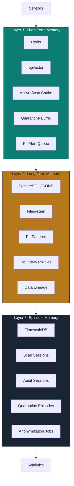
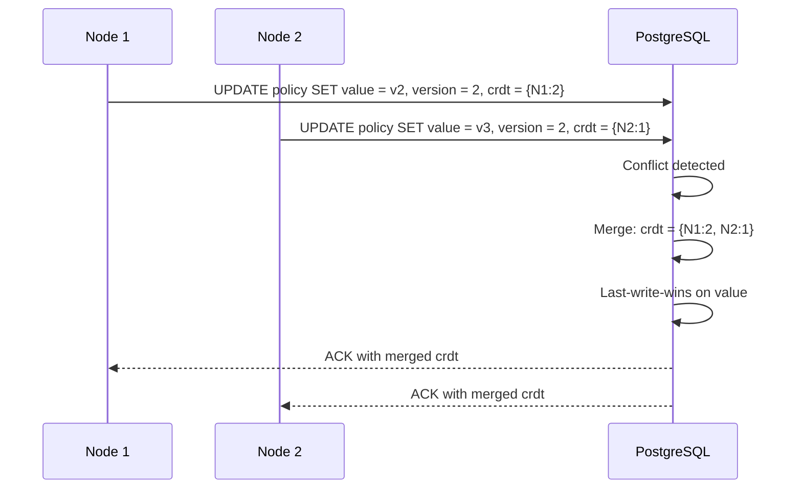
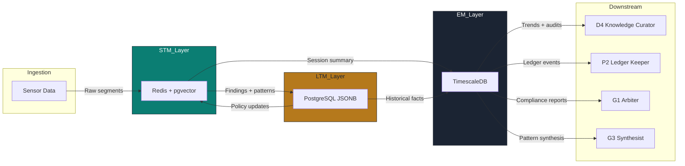

# G6 The Sentinel — Resilient Memory Architecture

> **Persona:** G6 The Sentinel  
> **Version:** 1.0.0  
> **Date:** 2026-07-01  
> **Backend Standard:** FastAPI + PostgreSQL 15 + Redis + pgvector + TimescaleDB  
> **Source Strategy:** `C:\KimiWork Projects\GAI-OBSERVE-DESIGN\skills-hooks-plugins-strategy\STRATEGY.md`  
> **Persona Definition:** `C:\KimiWork Projects\CORPORATE V 0.5\PERSONA_G6_The_Sentinel.md`  

---

## 1. Architecture Overview

G6 The Sentinel operates on a **3-layer resilient memory architecture** designed for high-throughput data governance, privacy-sensitive operations, and audit-grade provenance. The architecture separates volatile operational state (STM), durable knowledge (LTM), and time-series episodic records (EM) with distinct resilience patterns, privacy controls, and retrieval optimizations.

All layers use **JSON-compatible schemas**, **Pydantic v2 validation**, and **JWT-gated access** aligned with GAI-OBSERVE backend standards.



---

## 2. Layer 1: Short-Term Memory (STM)

### 2.1 Technology Stack

| Component | Technology | Purpose | Port | Auth |
|-----------|------------|---------|------|------|
| Cache | Redis 7 | Key-value store, session cache, job queue | 6379 | AUTH + TLS 1.3 |
| Vector Store | pgvector (PostgreSQL extension) | 128-dim embeddings, semantic similarity | 5432 | JWT + SSL |
| Message Queue | Redis Streams | Event streaming, PII alert queue | 6379 | AUTH + TLS 1.3 |

### 2.2 TTL Policy

| Data Type | Active TTL | Recent TTL | Archive Trigger |
|-----------|------------|------------|-----------------|
| Active scan session | 24h | 7d | Scan complete + 24h |
| Quarantine decision buffer | 4h | 7d | Quarantine resolved + 4h |
| PII alert queue | 1h | 24h | Alert acknowledged + 1h |
| Embedding cache | 24h | 7d | Job complete + 24h |
| Sensor segment buffer | 2h | 24h | Segment processed + 2h |

### 2.3 Schema

```json
{
  "turn_id": "turn-20260701-001",
  "timestamp": "2026-07-01T12:00:00Z",
  "persona_id": "G6",
  "arm_id": "arm-g6-01",
  "data_source_id": "ds-repo-healthcare-app-001",
  "pii_findings": [
    {
      "type": "patient_name",
      "count": 23,
      "confidence": 0.98,
      "locations": [
        "file:///logs/access.log:14:23",
        "file:///test/data.json:3:1"
      ],
      "redacted_preview": "[REDACTED-NAME]"
    }
  ],
  "boundary_status": "violation_detected",
  "quarantine_action": "blocked",
  "confidence": 0.98,
  "tags": ["phi", "hipaa", "log_file"],
  "embedding": [0.12, -0.05, 0.08, ...],
  "ttl": "2026-07-02T12:00:00Z",
  "session_id": "sess-20260701-001"
}
```

### 2.4 Special Collections

#### Active Scan Session Cache

```json
{
  "cache_key": "scan:active:ds-repo-001",
  "scan_id": "scan-20260701-001",
  "started_at": "2026-07-01T12:00:00Z",
  "progress_percent": 67,
  "files_scanned": 1023,
  "files_total": 1523,
  "pii_found": 47,
  "status": "running",
  "last_heartbeat": "2026-07-01T12:04:00Z",
  "worker_id": "sentinel-worker-03"
}
```

#### Quarantine Decision Buffer

```json
{
  "buffer_key": "quarantine:pending:evt-20260701-001",
  "event_id": "evt-20260701-001",
  "violation_type": "gdpr_cross_border",
  "data_source_id": "ds-analytics-backups",
  "source_jurisdiction": "EU",
  "target_jurisdiction": "US",
  "detected_at": "2026-07-01T12:00:00Z",
  "decision": "pending",
  "auto_action": "block",
  "human_override": null,
  "expires_at": "2026-07-01T16:00:00Z"
}
```

#### PII Alert Queue (Redis Stream)

```json
{
  "stream": "sentinel:pii_alerts",
  "message_id": "1699123456789-0",
  "payload": {
    "alert_id": "alert-20260701-001",
    "severity": "critical",
    "pii_type": "phi",
    "data_source_id": "ds-api-logs",
    "findings_count": 23,
    "confidence": 0.98,
    "timestamp": "2026-07-01T12:00:00Z",
    "escalation_target": "G2"
  }
}
```

### 2.5 Privacy Controls for STM

| Control | Implementation |
|---------|---------------|
| **PII Redaction** | All `pii_findings` values replaced with `[REDACTED-<TYPE>]`; only counts, types, and confidence stored |
| **Encryption** | AES-256-GCM for Redis values; TLS 1.3 for transit |
| **Access Control** | Redis ACL per arm; JWT role `sentinel_stm_reader` / `sentinel_stm_writer` |
| **Audit** | Every read/write logged to Kafka → P2 Ledger Keeper |
| **Auto-Expiry** | Redis TTL enforced; no manual deletion required |

---

## 3. Layer 2: Long-Term Memory (LTM)

### 3.1 Technology Stack

| Component | Technology | Purpose | Schema |
|-----------|------------|---------|--------|
| Primary Store | PostgreSQL 15 JSONB | Structured facts, policies, patterns | JSONB columns with GIN indexes |
| File Store | Filesystem (MinIO) | Large artifacts, models, reports | S3-compatible object storage |
| Sync | Append-only + CRDT | Concurrent policy updates, conflict resolution | Vector clocks + timestamp ordering |

### 3.2 Schema

```json
{
  "fact_id": "fact-pii-pattern-001",
  "category": "pii_pattern",
  "key": "ssn_regex_v3",
  "value": "^(?!000|666|9\\d{2})\\d{3}-(?!00)\\d{2}-(?!0000)\\d{4}$",
  "source": "NIST_PII_GUIDE_2025",
  "timestamp": "2026-07-01T00:00:00Z",
  "confidence": 0.99,
  "expiry": null,
  "data_source_id": null,
  "pii_type": "ssn",
  "jurisdiction": "US",
  "retention_policy": "indefinite",
  "anonymization_method": "mask_last_four",
  "version": 1,
  "previous_version": null,
  "crdt_vector": {"node-sentinel-01": 1, "node-sentinel-02": 0},
  "audit_trail": [
    {"action": "created", "by": "arm-g6-01", "at": "2026-07-01T00:00:00Z"}
  ]
}
```

### 3.3 Category Registry

| Category | Description | Example Key | Retention |
|----------|-------------|-------------|-----------|
| `pii_pattern` | Regex, ML model, or heuristic for PII detection | `ssn_regex_v3` | Indefinite |
| `boundary_policy` | Jurisdiction and residency rules | `eu_data_no_us_transfer` | Indefinite |
| `data_lineage` | Source-to-destination mapping | `ds-legacy-api-lineage` | 7 years |
| `retention_schedule` | Policy-mandated retention periods | `phi_logs_7_years` | Indefinite |
| `anonymization_map` | Pseudonymization key references | `ds-patient-records-v2` | 1 year |
| `data_source_profile` | Known characteristics of data sources | `ds-mri-docs-001` | Until deprecated |
| `jurisdiction_mapping` | GeoIP / cloud region to jurisdiction | `aws-us-east-1` | Until changed |
| `compliance_framework` | Regulatory requirements mapping | `hipaa_security_rule` | Until updated |

### 3.4 Sync Strategy: Append-Only + CRDT

LTM uses **append-only writes** with **CRDT (Conflict-free Replicated Data Types)** for concurrent policy updates across Sentinel nodes.



### 3.5 Privacy Controls for LTM

| Control | Implementation |
|---------|---------------|
| **Anonymization** | Pseudonymization key references only; actual keys in Vault |
| **Encryption** | PostgreSQL TDE (Transparent Data Encryption); MinIO SSE-S3 |
| **Access Control** | Row-level security (RLS) per arm; column-level masking for sensitive fields |
| **Audit** | pgAudit extension logs all DDL/DML; streamed to Kafka → P2 |
| **Backup** | WAL archiving to MinIO; point-in-time recovery; encrypted backups |

---

## 4. Layer 3: Episodic Memory (EM)

### 4.1 Technology Stack

| Component | Technology | Purpose |
|-----------|------------|---------|
| Time-Series DB | TimescaleDB (PostgreSQL extension) | Hypertables for scan sessions, audit sessions, quarantine episodes, anonymization jobs |
| Compression | TimescaleDB native | Automatic chunk compression after 7 days |
| Retention | TimescaleDB retention policy | Drop chunks after regulatory retention period |

### 4.2 Schema

```json
{
  "session_id": "sess-20260701-001",
  "persona_id": "G6",
  "arm_id": "arm-g6-01",
  "data_source_id": "ds-healthcare-app",
  "start_time": "2026-07-01T12:00:00Z",
  "end_time": "2026-07-01T12:04:30Z",
  "scan_results": {
    "total_files": 1523,
    "pii_instances": 47,
    "phi_instances": 23,
    "secret_instances": 3,
    "confidence_distribution": {
      "0.95-1.0": 68,
      "0.90-0.95": 5
    }
  },
  "boundary_violations": [
    "phi_in_llm_prompt",
    "pii_in_public_repo"
  ],
  "quarantine_actions": [
    "blocked_23",
    "flagged_12"
  ],
  "anonymization_summary": null,
  "embedding": [0.12, -0.05, 0.08, ...],
  "compression_ratio": 0.15,
  "cost_ms": 270000,
  "worker_id": "sentinel-worker-03",
  "ledger_hash": "a3f2..."
}
```

### 4.3 Hypertable Design

```sql
-- TimescaleDB hypertable for scan sessions
CREATE TABLE sentinel_episodes (
    session_id UUID PRIMARY KEY,
    persona_id TEXT NOT NULL,
    arm_id TEXT NOT NULL,
    data_source_id TEXT NOT NULL,
    start_time TIMESTAMPTZ NOT NULL,
    end_time TIMESTAMPTZ,
    scan_results JSONB,
    boundary_violations TEXT[],
    quarantine_actions TEXT[],
    anonymization_summary JSONB,
    embedding VECTOR(128),
    compression_ratio FLOAT,
    cost_ms INT,
    worker_id TEXT,
    ledger_hash TEXT
);

SELECT create_hypertable('sentinel_episodes', 'start_time', chunk_time_interval => INTERVAL '1 day');

-- Compression policy: compress after 7 days
SELECT add_compression_policy('sentinel_episodes', INTERVAL '7 days');

-- Retention policy: drop after 7 years (regulatory requirement)
SELECT add_retention_policy('sentinel_episodes', INTERVAL '7 years');
```

### 4.4 Retrieval Patterns

| Query Type | Filter | Index | Example |
|------------|--------|-------|---------|
| Time-range scan | `start_time` range | TimescaleDB time index | `start_time BETWEEN '2026-07-01' AND '2026-07-02'` |
| Data source history | `data_source_id` | B-tree | `data_source_id = 'ds-healthcare-app'` |
| PII type trend | `scan_results->pii_type` | GIN | `scan_results @> '{"pii_instances": {"type": "ssn"}}'` |
| Jurisdiction analysis | `boundary_violations` | GIN | `boundary_violations @> '{"gdpr_cross_border"}'` |
| Semantic similarity | `embedding` | pgvector HNSW | `embedding <-> query_embedding < 0.3` |
| Arm performance | `arm_id`, `cost_ms` | Composite | `arm_id = 'arm-g6-01' ORDER BY cost_ms DESC` |

### 4.5 Privacy Controls for EM

| Control | Implementation |
|---------|---------------|
| **Aggregation** | Raw PII counts only; no values stored; trends aggregated monthly |
| **Encryption** | TimescaleDB inherits PostgreSQL TDE |
| **Access Control** | Query-time RLS; `sentinel_em_reader` role for analytics; `sentinel_em_admin` for retention management |
| **Audit** | All queries logged; anomaly detection on unauthorized access patterns |
| **Retention** | Automatic chunk deletion per regulatory schedule; no manual purge required |

---

## 5. Memory Hooks & Resilience Patterns

### 5.1 Special Memory Hooks

| Hook Name | Trigger | Action | Source | Target |
|-----------|---------|--------|--------|--------|
| `pii_pattern_correlation` | New PII pattern detected | Correlate with existing patterns, flag conflicts | arm-g6-01 STM | LTM `pii_pattern` |
| `boundary_policy_versioning` | Policy update | Version policy, keep history, notify consumers | arm-g6-02 LTM | EM `policy_change` |
| `lineage_tracking` | Data movement | Record source, destination, transformation, actor | arm-g6-03 STM | LTM `data_lineage` |
| `quarantine_replay` | Audit request | Replay quarantine episode from EM | EM | G1 Arbiter |
| `anonymization_audit` | Annual audit | Retrieve all anonymization jobs for data source | EM | G1 + P2 |
| `retention_expiry` | Data expired | Trigger deletion workflow, record in EM | LTM `retention_schedule` | D3 + P2 |

### 5.2 Resilience Patterns

| Pattern | STM | LTM | EM |
|---------|-----|-----|-----|
| **Replication** | Redis Sentinel (3-node) | PostgreSQL streaming replication (async) | TimescaleDB streaming replication |
| **Failover** | Sentinel auto-promotion | Patroni auto-failover | Patroni auto-failover |
| **Backup** | RDB snapshot every 15m | WAL archiving to MinIO | Continuous backup via pgBackRest |
| **Recovery** | RDB restore from snapshot | PITR to any timestamp | PITR + chunk-level restore |
| **Consistency** | Eventual (Redis) | Strong (PostgreSQL ACID) | Strong (PostgreSQL ACID) |
| **Partitioning** | Key prefix per arm | Table partitioning by category | Hypertable chunking by time |
| **Circuit Breaker** | Redis unavailable → degrade to LTM | PostgreSQL unavailable → queue in Redis | TimescaleDB unavailable → queue in PostgreSQL primary |

### 5.3 Cross-Layer Data Flow



---

## 6. Privacy Architecture Summary

| Layer | PII Storage | Values | Keys | Retention | Access |
|-------|-------------|--------|------|-----------|--------|
| **STM** | Redacted | Counts, types, confidence only | No | 24h active / 7d recent | Arm-scoped JWT |
| **LTM** | Anonymized | Pattern references, policy rules, metadata | Pseudonym references only | Indefinite (policies) / 1yr (maps) | RLS + column masking |
| **EM** | Aggregated | Statistical distributions, violation counts | None | 7 years (regulatory) | Query-scoped JWT |

**Golden Rule:** No layer stores raw PII values. STM redacts immediately. LTM stores references only. EM stores aggregates only. Raw data remains in the source system or secure quarantine vault.

---

**Document Owner:** GAI-OBSERVE Advisory Architecture Team  
**Classification:** Internal — Architecture  
**Next Review:** 2026-08-01
