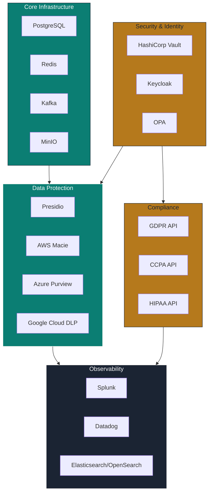

# G6 The Sentinel — Plugin Registry

> **Persona:** G6 The Sentinel  
> **Version:** 1.0.0  
> **Date:** 2026-07-01  
> **Source Strategy:** `C:\KimiWork Projects\GAI-OBSERVE-DESIGN\skills-hooks-plugins-strategy\STRATEGY.md`  
> **Governance Nexus:** `C:\KimiWork Projects\GAI-OBSERVE-DESIGN\skills-hooks-plugins-strategy\INITIATIVE_07_GOVERNANCENEXUS_AUGMENTATION.md`  
> **EdGuide:** `C:\KimiWork Projects\GAI-OBSERVE-DESIGN\skills-hooks-plugins-strategy\EDUGAI_AUGMENTATION.md`  

---

## 1. Registry Overview

This document defines the complete plugin configuration for G6 The Sentinel. Plugins are **external data sources, MCP tools, browser automations, and compliance APIs** that augment the arm's capabilities. Each plugin entry includes installation, configuration, authentication, health check, quota, security, and arm integration specifications.

All plugins follow the GAI-OBSERVE backend standard: **FastAPI**, **PostgreSQL**, **Redis**, **JWT**, **Pydantic v2**.

---

## 2. PII & Data Protection Plugins

### 2.1 Microsoft Presidio

| Field | Value |
|-------|-------|
| **Name** | `presidio` |
| **Type** | PII Detection / Anonymization Engine |
| **Installation** | `pip install presidio-analyzer presidio-anonymizer` + spaCy models (`en_core_web_lg`, `de_core_news_lg`, etc.) |
| **Config** | `{"analyzer": {"nlp_engine": "spacy", "recognizers": ["default", "custom"]}, "anonymizer": {"operators": {"PERSON": "replace", "PHONE_NUMBER": "mask"}}}` |
| **Auth** | None (local) / API key for cloud variant |
| **Health Check** | `GET /health` → `{"status": "healthy", "models_loaded": true}` |
| **Quotas** | 1000 requests/min (local), 500 requests/min (cloud) |
| **Security** | Runs in isolated Docker container; no network egress for local mode |
| **Arm Integration** | arm-g6-01 (PII Detector), arm-g6-05 (Anonymization Engine) |
| **Status** | P2 — Planned for Phase 4 (Governance Nexus) |

### 2.2 AWS Macie

| Field | Value |
|-------|-------|
| **Name** | `aws_macie` |
| **Type** | Cloud PII Detection (S3) |
| **Installation** | AWS SDK + Macie v2 API enablement |
| **Config** | `{"region": "us-east-1", "classification_jobs": [{"s3_bucket": "*", "job_type": "SENSITIVE_DATA_DISCOVERY"}]}` |
| **Auth** | AWS IAM role with `macie2:*` + `s3:GetObject` |
| **Health Check** | `aws macie2 get-macie-session --region us-east-1` |
| **Quotas** | 20 active classification jobs per account |
| **Security** | IAM role with least privilege; VPC endpoints for private traffic |
| **Arm Integration** | arm-g6-01 (PII Detector) |
| **Status** | P2 — Optional cloud augmentation |

### 2.3 Azure Purview

| Field | Value |
|-------|-------|
| **Name** | `azure_purview` |
| **Type** | Cloud Data Catalog + PII Detection |
| **Installation** | Azure SDK + Purview account |
| **Config** | `{"tenant_id": "...", "subscription_id": "...", "resource_group": "gai-observe", "account_name": "gai-observe-purview"}` |
| **Auth** | Azure AD Service Principal + Client Secret (Vault-rotated) |
| **Health Check** | `GET https://{account}.purview.azure.com/catalog/api/atlas/v2/types/typedefs` → 200 |
| **Quotas** | 1000 scans/month (standard tier) |
| **Security** | Managed Identity preferred; secret in Vault; TLS 1.3 |
| **Arm Integration** | arm-g6-01 (PII Detector), arm-g6-02 (Data Boundary Enforcer) |
| **Status** | P2 — Optional cloud augmentation |

### 2.4 Google Cloud DLP

| Field | Value |
|-------|-------|
| **Name** | `google_cloud_dlp` |
| **Type** | Cloud PII Detection / De-identification |
| **Installation** | `pip install google-cloud-dlp` |
| **Config** | `{"project_id": "gai-observe", "location": "global", "inspect_template": "g6-pii-template", "deidentify_template": "g6-anonymize-template"}` |
| **Auth** | GCP Service Account JSON (Vault-rotated) |
| **Health Check** | `dlp.projects.inspectTemplates.list(name=projects/gai-observe)` |
| **Quotas** | 600 requests/min (standard) |
| **Security** | Service account with `roles/dlp.user`; CMEK for sensitive inspections |
| **Arm Integration** | arm-g6-01 (PII Detector), arm-g6-05 (Anonymization Engine) |
| **Status** | P2 — Optional cloud augmentation |

---

## 3. Policy & Governance Plugins

### 3.1 Open Policy Agent (OPA)

| Field | Value |
|-------|-------|
| **Name** | `opa` |
| **Type** | Policy-as-Code Engine |
| **Installation** | `docker run -p 8181:8181 openpolicyagent/opa:latest` or Kubernetes deployment |
| **Config** | `{"bundle": "gai-observe-policies", "decision_logs": {"console": true, "mask": ["/input/password"]}, "discovery": {"name": "gai-observe", "prefix": "bundles"}}` |
| **Auth** | Bearer token (OPA API) + mTLS (production) |
| **Health Check** | `GET /health` → `{"status": "UP"}` |
| **Quotas** | 10,000 decisions/sec per OPA instance |
| **Security** | Bundle signed with Ed25519; decision logs masked for PII; mTLS in production |
| **Arm Integration** | arm-g6-02 (Data Boundary Enforcer) |
| **Status** | P1 — Required for Governance Nexus Phase 4 |

### 3.2 Apache Ranger

| Field | Value |
|-------|-------|
| **Name** | `apache_ranger` |
| **Type** | Data Access Policy Engine |
| **Installation** | Docker Compose or Helm chart with PostgreSQL backend |
| **Config** | `{"admin": {"user": "admin", "pass": "vault://ranger/admin"}, "plugins": ["hive", "hbase", "kafka", "hdfs"], "audit_store": "solr"}` |
| **Auth** | Kerberos + LDAP integration or Ranger admin credentials (Vault-rotated) |
| **Health Check** | `GET /service/public/v2/api/service` → 200 |
| **Quotas** | 5000 policy evaluations/sec |
| **Security** | Audit logs to Solr/Elasticsearch; admin credentials in Vault |
| **Arm Integration** | arm-g6-02 (Data Boundary Enforcer) |
| **Status** | P2 — Optional for big data environments |

### 3.3 DataGov API

| Field | Value |
|-------|-------|
| **Name** | `datagov_api` |
| **Type** | Internal Data Governance API |
| **Installation** | FastAPI service from KIW-DGS DataGov arm |
| **Config** | `{"base_url": "http://datagov:8000", "timeout": 30, "retry": 3, "cache_ttl": 300}` |
| **Auth** | JWT RS256 + `datagov_read` or `datagov_write` role |
| **Health Check** | `GET /health` → `{"status": "healthy", "db_connected": true}` |
| **Quotas** | 1000 requests/min per API key |
| **Security** | RBAC; PII redaction in logs; TLS 1.3 in production |
| **Arm Integration** | All G6 arms |
| **Status** | P0 — Core dependency |

---

## 4. Identity & Secret Management Plugins

### 4.1 HashiCorp Vault

| Field | Value |
|-------|-------|
| **Name** | `hashicorp_vault` |
| **Type** | Secret Management / Key Management |
| **Installation** | `docker run -p 8200:8200 hashicorp/vault:latest` or Kubernetes via Helm |
| **Config** | `{"addr": "https://vault.gai-observe.internal:8200", "auth_method": "kubernetes", "role": "g6-sentinel", "kv_version": "v2", "engine": "transit"}` |
| **Auth** | Kubernetes Service Account (dev) / AppRole with wrapped secret_id (prod) |
| **Health Check** | `GET /v1/sys/health` → `{"initialized": true, "sealed": false, "standby": false}` |
| **Quotas** | 25,000 requests/sec (enterprise), 2,000 requests/sec (open source) |
| **Security** | Auto-unseal with AWS KMS / Azure Key Vault; audit log to Splunk; mTLS; HSM optional |
| **Arm Integration** | arm-g6-02 (Data Boundary Enforcer), arm-g6-05 (Anonymization Engine), all secret tools |
| **Status** | P0 — Required for Governance Nexus Phase 4 |

### 4.2 Keycloak

| Field | Value |
|-------|-------|
| **Name** | `keycloak` |
| **Type** | Identity / SSO / OIDC / SAML |
| **Installation** | `docker run -p 8080:8080 keycloak/keycloak:latest` or Kubernetes operator |
| **Config** | `{"realm": "gai-observe", "client_id": "g6-sentinel", "auth_server_url": "https://keycloak.gai-observe.internal", "verify_token_audience": true}` |
| **Auth** | Client credentials (Vault-rotated) + realm admin token |
| **Health Check** | `GET /health/ready` → `{"status": "UP"}` |
| **Quotas** | 1000 login/sec per realm |
| **Security** | LDAPS integration; brute force detection; audit log to PostgreSQL; TLS 1.3 |
| **Arm Integration** | arm-g6-02 (Data Boundary Enforcer — access control) |
| **Status** | P0 — Required for Governance Nexus Phase 4 |

---

## 5. Compliance API Plugins

### 5.1 GDPR Compliance API

| Field | Value |
|-------|-------|
| **Name** | `gdpr_compliance_api` |
| **Type** | Regulatory Framework API |
| **Installation** | REST API integration (OneTrust, BigID, or custom) |
| **Config** | `{"base_url": "https://api.onetrust.com", "version": "v3", "modules": ["data-mapping", "assessment", "consent", "incident"], "cache_ttl": 3600}` |
| **Auth** | OAuth 2.0 client credentials (Vault-rotated) |
| **Health Check** | `GET /api/v3/health` → 200 |
| **Quotas** | 500 requests/min |
| **Security** | OAuth token rotation every 3600s; TLS 1.3; PII redaction in request logs |
| **Arm Integration** | arm-g6-02 (Data Boundary Enforcer) |
| **Status** | P2 — Enterprise compliance augmentation |

### 5.2 CCPA Compliance API

| Field | Value |
|-------|-------|
| **Name** | `ccpa_compliance_api` |
| **Type** | Regulatory Framework API |
| **Installation** | REST API integration (OneTrust, BigID, or custom) |
| **Config** | `{"base_url": "https://api.onetrust.com", "version": "v3", "modules": ["consumer-rights", "sale-opt-out", "data-mapping"], "cache_ttl": 3600}` |
| **Auth** | OAuth 2.0 client credentials (Vault-rotated) |
| **Health Check** | `GET /api/v3/health` → 200 |
| **Quotas** | 500 requests/min |
| **Security** | OAuth token rotation every 3600s; TLS 1.3; PII redaction in request logs |
| **Arm Integration** | arm-g6-02 (Data Boundary Enforcer) |
| **Status** | P2 — Enterprise compliance augmentation |

### 5.3 HIPAA Compliance API

| Field | Value |
|-------|-------|
| **Name** | `hipaa_compliance_api` |
| **Type** | Regulatory Framework API |
| **Installation** | REST API integration (Vanta, Drata, or custom) |
| **Config** | `{"base_url": "https://api.vanta.com", "version": "v1", "modules": ["security", "privacy", "risk"], "cache_ttl": 3600}` |
| **Auth** | API key (Vault-rotated) |
| **Health Check** | `GET /v1/health` → 200 |
| **Quotas** | 300 requests/min |
| **Security** | API key rotation every 90 days; TLS 1.3; HITRUST-aligned |
| **Arm Integration** | arm-g6-01 (PII Detector), arm-g6-02 (Data Boundary Enforcer) |
| **Status** | P2 — Healthcare compliance augmentation |

---

## 6. Observability & SIEM Plugins

### 6.1 Splunk

| Field | Value |
|-------|-------|
| **Name** | `splunk` |
| **Type** | SIEM / Log Aggregation |
| **Installation** | Splunk Enterprise or Splunk Cloud HEC |
| **Config** | `{"host": "splunk.gai-observe.internal", "port": 8088, "index": "gai_observe_sentinel", "sourcetype": "_json", "ssl_verify": true}` |
| **Auth** | HEC token (Vault-rotated) |
| **Health Check** | `POST /services/collector/event` → `{"text": "Success", "code": 0}` |
| **Quotas** | 1 MB/event, 1 TB/day |
| **Security** | HEC over TLS; token rotation; index-level RBAC |
| **Arm Integration** | All arms (audit logging) |
| **Status** | P1 — Planned for Governance Nexus Phase 2 |

### 6.2 Datadog

| Field | Value |
|-------|-------|
| **Name** | `datadog` |
| **Type** | Cloud Monitoring / APM / SIEM |
| **Installation** | `pip install datadog` + agent |
| **Config** | `{"api_url": "https://api.datadoghq.com", "site": "datadoghq.com", "metrics": {"prefix": "gai.observe.sentinel"}, "logs": {"source": "sentinel", "service": "g6"}}` |
| **Auth** | API key + Application key (Vault-rotated) |
| **Health Check** | `GET /api/v1/validate` → 200 |
| **Quotas** | 500 metrics/series, 1M log events/day |
| **Security** | API key in Vault; TLS 1.3; log scrubbing for PII |
| **Arm Integration** | All arms (metrics, logs, tracing) |
| **Status** | P1 — Alternative to Splunk |

### 6.3 Elasticsearch / OpenSearch

| Field | Value |
|-------|-------|
| **Name** | `elasticsearch` / `opensearch` |
| **Type** | Search / Log Aggregation / SIEM |
| **Installation** | Docker Compose or Kubernetes (OpenSearch preferred for license) |
| **Config** | `{"hosts": ["https://opensearch:9200"], "index": "gai-observe-sentinel", "auth": {"type": "basic", "user": "sentinel", "pass": "vault://opensearch/sentinel"}}` |
| **Auth** | Basic auth (Vault-rotated) or IAM roles |
| **Health Check** | `GET /_cluster/health` → `{"status": "green"}` |
| **Quotas** | 1000 index requests/sec |
| **Security** | TLS 1.3; role-based access; index-level security; PII redaction pipeline |
| **Arm Integration** | arm-g6-03 (Multimodal Perceiver — indexing), all arms (log search) |
| **Status** | P1 — Core observability dependency |

---

## 7. Data & Storage Plugins

### 7.1 MinIO

| Field | Value |
|-------|-------|
| **Name** | `minio` |
| **Type** | Object Storage (S3-compatible) |
| **Installation** | `docker run -p 9000:9000 -p 9001:9001 minio/minio:latest server /data --console-address :9001` |
| **Config** | `{"endpoint": "minio.gai-observe.internal:9000", "access_key": "vault://minio/sentinel_access_key", "secret_key": "vault://minio/sentinel_secret_key", "bucket": "sentinel-artifacts", "secure": true}` |
| **Auth** | Access key + Secret key (Vault-rotated) |
| **Health Check** | `GET /minio/health/live` → 200 |
| **Quotas** | 10 TB per deployment |
| **Security** | TLS 1.3; bucket policies; encryption-at-rest (SSE-S3); versioning; object lock |
| **Arm Integration** | arm-g6-03 (Multimodal Perceiver — artifact storage), arm-g6-05 (Anonymization Engine — package storage) |
| **Status** | P1 — Core storage dependency |

### 7.2 PostgreSQL

| Field | Value |
|-------|-------|
| **Name** | `postgresql` |
| **Type** | Relational Database / LTM / Audit Store |
| **Installation** | `docker run -p 5433:5432 postgres:15` (dev offset) |
| **Config** | `{"host": "postgres", "port": 5432, "database": "gai_observe_sentinel", "user": "sentinel", "password": "vault://postgres/sentinel", "pool_size": 20, "max_overflow": 10, "pool_timeout": 30}` |
| **Auth** | Database user + password (Vault-rotated) + SSL mode |
| **Health Check** | `SELECT 1` → 1 |
| **Quotas** | 500 concurrent connections |
| **Security** | TLS 1.3; row-level security; audit trigger; pgAudit extension; credential rotation via Vault |
| **Arm Integration** | All arms (LTM, EM, audit logs) |
| **Status** | P0 — Core database dependency |

### 7.3 Redis

| Field | Value |
|-------|-------|
| **Name** | `redis` |
| **Type** | Cache / STM / Queue / Rate Limiter |
| **Installation** | `docker run -p 6380:6379 redis:7` (dev offset) |
| **Config** | `{"host": "redis", "port": 6379, "db": 0, "password": "vault://redis/sentinel", "ssl": true, "decode_responses": true, "socket_timeout": 5}` |
| **Auth** | Redis AUTH password (Vault-rotated) + TLS |
| **Health Check** | `PING` → `PONG` |
| **Quotas** | 100,000 ops/sec |
| **Security** | TLS 1.3; AUTH; ACL (Redis 6+); key prefix isolation; no PII in cache keys |
| **Arm Integration** | All arms (STM, session cache, job queue) |
| **Status** | P0 — Core cache dependency |

### 7.4 Kafka

| Field | Value |
|-------|-------|
| **Name** | `kafka` |
| **Type** | Event Streaming / Audit Log Pipeline |
| **Installation** | Docker Compose or Kubernetes (Strimzi operator) |
| **Config** | `{"bootstrap_servers": "kafka:9092", "topic_prefix": "gai-observe.sentinel", "security_protocol": "SASL_SSL", "sasl_mechanism": "SCRAM-SHA-512", "sasl_username": "sentinel"}` |
| **Auth** | SASL/SCRAM + TLS 1.3; credentials in Vault |
| **Health Check** | `kafka-broker-api-versions.sh --bootstrap-server kafka:9092` |
| **Quotas** | 1M messages/sec per cluster |
| **Security** | ACL per topic; encrypted in transit (TLS) and at rest; audit log enabled; PII redaction in event values |
| **Arm Integration** | arm-g6-02 (Data Boundary Enforcer — event streaming), P2 (Ledger Keeper — audit events) |
| **Status** | P1 — Core event streaming dependency |

### 7.5 OpenSearch

| Field | Value |
|-------|-------|
| **Name** | `opensearch` |
| **Type** | Search / Log Analytics |
| **Installation** | Docker Compose or Kubernetes |
| **Config** | `{"hosts": ["https://opensearch:9200"], "index": "sentinel-logs", "auth": {"type": "basic", "user": "sentinel", "pass": "vault://opensearch/sentinel"}, "ssl_verify": true}` |
| **Auth** | Basic auth (Vault-rotated) |
| **Health Check** | `GET /_cluster/health` → `{"status": "green"}` |
| **Quotas** | 1000 search requests/sec |
| **Security** | TLS 1.3; fine-grained access control; index-level security; PII detection pipeline |
| **Arm Integration** | arm-g6-03 (Multimodal Perceiver — semantic indexing) |
| **Status** | P1 — Alternative to Elasticsearch |

---

## 8. Plugin Dependency Matrix

---

**Document Owner:** GAI-OBSERVE Advisory Architecture Team  
**Classification:** Internal — Plugin Registry  
**Next Review:** 2026-08-01
